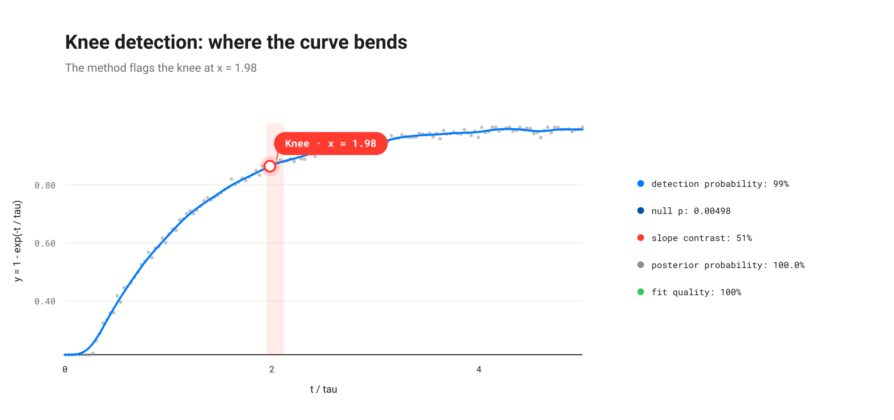
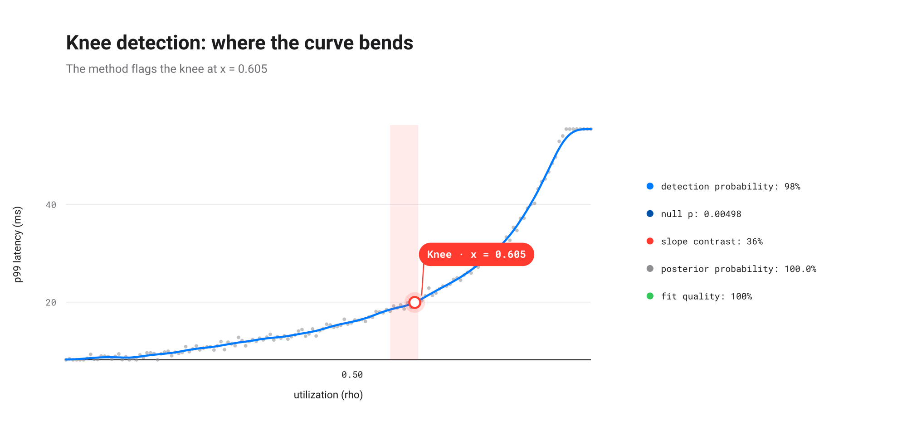
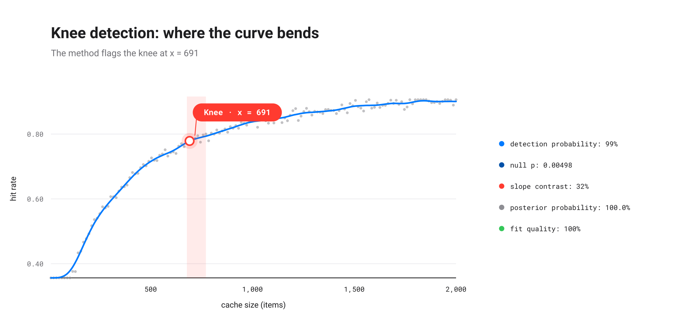
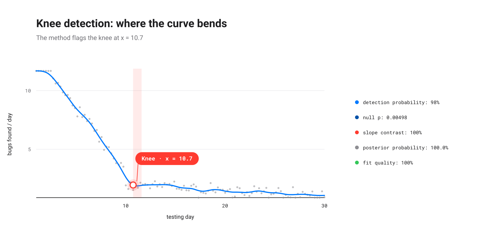

# EXAMPLES.md

Runnable recipes for `elbow-helper`. Each one is also a standalone script
under `examples/`: copy the code or just run the file. See
[`README.md`](README.md) for the full API reference and the pipeline this
all rests on.

## 1. A clear, saturating knee

The most common case: a curve that rises, bends, and flattens, with enough
signal for the pipeline to commit to a point estimate.

```python
import numpy as np
from elbow_helper import RobustKneeConfig, robust_knee

rng = np.random.default_rng(1)
x = np.linspace(0.0, 1.0, 80)
knee = 0.30
y = np.where(x <= knee, 3.0 * x, 3.0 * knee + 0.2 * (x - knee))
y = y / y.max() + rng.normal(0, 0.02, x.size)

result = robust_knee(
    x, y, curve="concave", direction="increasing",
    config=RobustKneeConfig(random_seed=0),
)

print(result)
if result.is_clear:
    print(f"  true knee ~ {knee}, located at {result.knee_x:.3f}")
    print(f"  90% CI    = ({result.ci90[0]:.3f}, {result.ci90[1]:.3f})")
    print(f"  detection = {result.detection_rate:.2f}, null p = {result.null_p_value:.3g}")
```

```text
ClearKnee(knee_x=0.3418, ci90=(0.3418, 0.3797), detection_rate=0.98, null_p=0.00498)
  true knee ~ 0.3, located at 0.342
  90% CI    = (0.342, 0.380)
  detection = 0.98, null p = 0.00498
```

The point estimate never travels alone: `ci90` bounds it, `detection_rate`
says how often an independent resample of the noise finds the same knee, and
`null_p_value` says how surprising this knee would be if the curve were
secretly just a straight line plus noise.

Full script: [`examples/clear_knee.py`](examples/clear_knee.py).

## 2. The k-means "elbow" (convex, decreasing)

`robust_elbow` is `robust_knee` with `curve`/`direction` pinned to the
classic scree-plot shape: inertia falling fast, then flattening as extra
clusters stop paying for themselves.

```python
import numpy as np
from elbow_helper import RobustKneeConfig, robust_elbow

rng = np.random.default_rng(3)
k = np.arange(1, 41, dtype=float)
inertia = np.where(k <= 8, 1000 - 90 * k, 280 - 3 * (k - 8))
inertia = inertia + rng.normal(0, 4.0, k.size)

result = robust_elbow(k, inertia, config=RobustKneeConfig(random_seed=0))

print(result)
if result.is_clear:
    print(f"  elbow at k = {result.knee_x:.1f}  (true k = 8)")
    print(f"  90% CI     = ({result.ci90[0]:.1f}, {result.ci90[1]:.1f})")
```

```text
ClearKnee(knee_x=9, ci90=(9, 11.5), detection_rate=1.00, null_p=0.00498)
  elbow at k = 9.0  (true k = 8)
  90% CI     = (9.0, 11.5)
```


Full script: [`examples/kmeans_elbow.py`](examples/kmeans_elbow.py).

## 3. Explicit abstention, not a fake knee

A noisy but genuinely monotone straight line has no knee. The pipeline says
so, with a machine-readable reason, instead of returning a plausible-looking
but spurious point.

```python
import numpy as np
from elbow_helper import RobustKneeConfig, robust_knee

rng = np.random.default_rng(2)
x = np.linspace(0.0, 1.0, 80)
y = 0.2 + 0.5 * x + rng.normal(0, 0.01, x.size)  # monotone, no knee

result = robust_knee(
    x, y, curve="concave", direction="increasing",
    config=RobustKneeConfig(random_seed=0),
)

print(result)
print(f"  reason = {result.reason}")
```

```text
NoClearKnee(reason='NO_PERSISTENT_CLUSTER')
  reason = NO_PERSISTENT_CLUSTER
```

Every abstention carries one of the fifteen reason codes documented in the
README's "Abstention reason codes" section; `result.diagnostics` has the
full numeric trail behind the decision, useful for tuning `RobustKneeConfig`
against your own curve family.

Full script: [`examples/no_knee.py`](examples/no_knee.py).

## 4. A saturating curve: `1 - exp(-t / tau)`

Charging voltages, learning curves, and dose-response curves all share this
shape: a rise that is fast at first, then approaches a ceiling
asymptotically. It is a useful stress test: unlike a broken-line knee, it
has no true slope discontinuity, it is smooth everywhere.

```python
import numpy as np
from elbow_helper import RobustKneeConfig, robust_knee

tau = 1.0
rng = np.random.default_rng(4)
t = np.linspace(0.0, 5.0 * tau, 150)
y = 1.0 - np.exp(-t / tau)
y = y + rng.normal(0, 0.01, t.size)

result = robust_knee(
    t, y, curve="concave", direction="increasing",
    config=RobustKneeConfig(random_seed=0),
)

print(result)
if result.is_clear:
    print(f"  knee at t = {result.knee_x:.3f}  (tau = {tau})")
```

```text
ClearKnee(knee_x=1.980, ci90=(1.946, 2.114), detection_rate=0.99, null_p=0.00498)
  knee at t = 1.980  (tau = 1.0)
```

Worth knowing before reading too much into the exact number: the located
knee sits consistently around **1.9 tau**, not 1 tau. The textbook "time
constant" tau marks `1 - e^-1 ≈ 63%` of the rise, mathematically clean but
not where a curve visually reads as "flattened". The pipeline (like a human
eye) settles on roughly 2 time constants (`1 - e^-2 ≈ 85%`), the same
informal "practically settled" convention used in RC-circuit and
control-theory contexts. This ratio is a property of the *observation
window* as much as of the curve: measured here over `t ∈ [0, 5·tau]`, it
would shift under a narrower or wider window, since the decision is about
maximum deviation from the chord spanning whatever range it is actually
given, not an intrinsic property of the infinite curve.



Full script: [`examples/exponential_saturation.py`](examples/exponential_saturation.py).

## 5. Queueing latency: a capacity-planning knee

A single-server queue's response time grows like `1 / (1 - rho)` in its
utilization `rho`, a classic M/M/1-style blow-up. This curve is convex and
increasing rather than the concave, saturating shapes above: the knee here
marks not a ceiling but an acceleration, the point past which a little
more load costs a lot more latency.

```python
import numpy as np
from elbow_helper import RobustKneeConfig, robust_knee

baseline_ms = 8.0
rng = np.random.default_rng(7)
rho = np.linspace(0.02, 0.90, 150)
latency_ms = baseline_ms / (1.0 - rho)
latency_ms = latency_ms + rng.normal(0, 0.6, rho.size)

result = robust_knee(
    rho, latency_ms, curve="convex", direction="increasing",
    config=RobustKneeConfig(random_seed=0),
)

print(result)
if result.is_clear:
    knee_latency = baseline_ms / (1.0 - result.knee_x)
    print(f"  knee at utilization = {result.knee_x:.3f}  ({result.knee_x:.0%} of capacity)")
    print(f"  latency at knee     = {knee_latency:.1f} ms  ({knee_latency/baseline_ms:.1f}x baseline)")
```

```text
ClearKnee(knee_x=0.6047, ci90=(0.5634, 0.6106), detection_rate=0.98, null_p=0.00498)
  knee at utilization = 0.605  (60% of capacity)
  latency at knee     = 20.2 ms  (2.5x baseline)
```



The knee lands at 60% utilization, well before the mathematical blow-up
at 100%, at about 2.5x the baseline latency. A queue is already paying a
real tax at 60% utilization: the curve only looks flat up to there because
`1 / (1 - rho)` is still small on an absolute scale.

Full script: [`examples/queueing_latency.py`](examples/queueing_latency.py).

## 6. Cache sizing: diminishing returns

How big should a cache be? For a working set with roughly power-law-popular
items, hit rate as a function of cache size `C` follows a
Michaelis-Menten shape, `C / (C + K)`, with `K` the cache size at which
half the working set is already resident. Concave and increasing, like
`1 - exp(-t/tau)` above, but built from a rational function rather than an
exponential.

```python
import numpy as np
from elbow_helper import RobustKneeConfig, robust_knee

K = 200.0
rng = np.random.default_rng(11)
cache_size = np.linspace(10, 2000, 150)
hit_rate = cache_size / (cache_size + K)
hit_rate = hit_rate + rng.normal(0, 0.01, cache_size.size)

result = robust_knee(
    cache_size, hit_rate, curve="concave", direction="increasing",
    config=RobustKneeConfig(random_seed=0),
)

print(result)
if result.is_clear:
    print(f"  knee at cache size = {result.knee_x:.0f} items  ({result.knee_x/K:.2f}x K)")
```

```text
ClearKnee(knee_x=691.1, ci90=(677.8, 771.3), detection_rate=0.99, null_p=0.00498)
  knee at cache size = 691 items  (3.46x K)
```



The knee lands around `3.5 * K`, not at `K` itself. `K` only marks the
50%-hit-rate point, a property of the formula's algebra, not of where the
*marginal* return on cache size actually stops paying off.

Full script: [`examples/cache_hit_rate.py`](examples/cache_hit_rate.py).

## 7. When to stop testing

Reliability-growth models describe defect discovery during testing as fast
at first (the easy, high-impact bugs) then slow (the rare, deep ones): a
curve that falls steeply, bends, and flattens into a long, low tail. The
same convex/decreasing family as the k-means and PCA examples, run on a
release-engineering question instead of a clustering or dimensionality
one.

```python
import numpy as np
from elbow_helper import RobustKneeConfig, robust_knee

true_knee_day = 10.0
rng = np.random.default_rng(13)
days = np.linspace(1, 30, 120)
bugs_per_day = np.where(
    days <= true_knee_day,
    14.0 - 1.1 * days,
    2.0 - 0.05 * (days - true_knee_day),
)
bugs_per_day = np.clip(bugs_per_day + rng.normal(0, 0.3, days.size), 0, None)

result = robust_knee(
    days, bugs_per_day, curve="convex", direction="decreasing",
    config=RobustKneeConfig(random_seed=0),
)

print(result)
if result.is_clear:
    print(f"  knee at day = {result.knee_x:.1f}  (true knee = {true_knee_day:.0f})")
```

```text
ClearKnee(knee_x=10.75, ci90=(10.75, 11.6), detection_rate=0.98, null_p=0.00498)
  knee at day = 10.7  (true knee = 10)
```



The located knee sits about a day past the true break, the same small,
systematic "one to two units past the true bend" offset the PCA scree
example shows in `doc/ELBOW-en.tex`. Reading `knee_x` as "stop testing
exactly here" rather than "the discovery rate has now genuinely
flattened, a day or two either side" over-trusts the point estimate past
what it actually claims.

Full script: [`examples/bug_discovery_rate.py`](examples/bug_discovery_rate.py).

## 8. The diagnostic figure

`elbow_helper.plotting` needs no extra install: it writes a self-contained
SVG by hand, no matplotlib.

```python
from elbow_helper import RobustKneeConfig
from elbow_helper.plotting import plot_diagnostics

plot_diagnostics(
    x, y, curve="concave", direction="increasing",
    config=RobustKneeConfig(random_seed=0),
    out="diagnostics.svg",
    language="en",   # or "fr"
)
```

The figure shows the curve with its located knee and 90% CI band (or, on
abstention, a greyed dashed curve and the reason) next to a compact evidence
legend: detection probability, null-model p-value, slope contrast, a
BIC-derived posterior model probability (a bounded `[0, 1]` reading, e.g.
"99.9%", not the raw, unbounded `bic_improvement` nats the API itself
returns, since a raw log-likelihood difference has no natural scale to
compare against), and a fit-quality score normalized against a
deliberately pessimistic worst case (the hardest single observed point to
predict everything else from) rather than the sample mean, which a real
fit can too easily do worse than. See `doc/ELBOW-en.tex` for the
derivation of both normalizations.

Full script: [`examples/diagnostic_plot.py`](examples/diagnostic_plot.py).

## 9. The standalone locator

The from-scratch bump-peak locator underneath `robust_knee` is usable on its
own, without the full conservative pipeline: no bootstrap, no null test, no
persistence clustering, just the geometric peak-finding step.

```python
from elbow_helper import KneeLocator

kl = KneeLocator(x, y, S=1.0, curve="concave", direction="increasing", online=True)
kl.knee, kl.all_knees
```

Useful for exploring a curve interactively or as a building block in your
own pipeline; `robust_knee` is the one to reach for when you need the
uncertainty estimate and the abstention guarantee.

## 10. Tuning the configuration

Every threshold lives in `RobustKneeConfig`, a frozen dataclass. The shipped
defaults favour speed (modest replicate counts, a run finishes in seconds);
raise them for a validation-grade run:

```python
from elbow_helper import RobustKneeConfig

config = RobustKneeConfig(bootstrap_replicates=100, null_replicates=200)
validation_config = config.with_(bootstrap_replicates=500, null_replicates=1000)
```

`cluster_tolerance` and `max_neighbor_shift` are the two most worth
recalibrating for your own data: they sit slightly above the 0.05 reference
value to absorb the locator's discretisation jitter at modest sample sizes
(n around 60-100): tighten them for cleaner, larger datasets, loosen them
for noisier or shorter ones.
