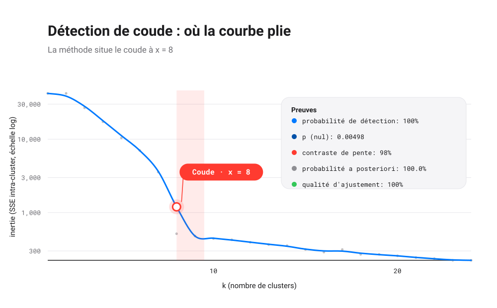
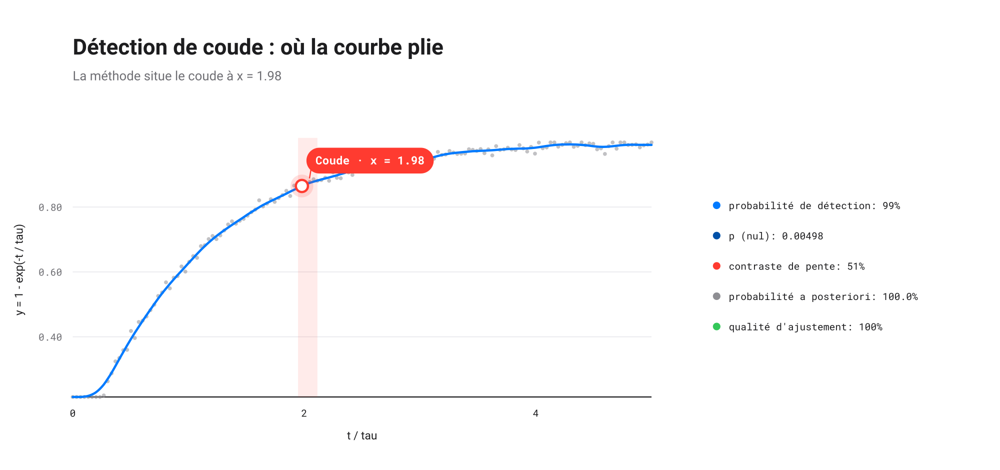
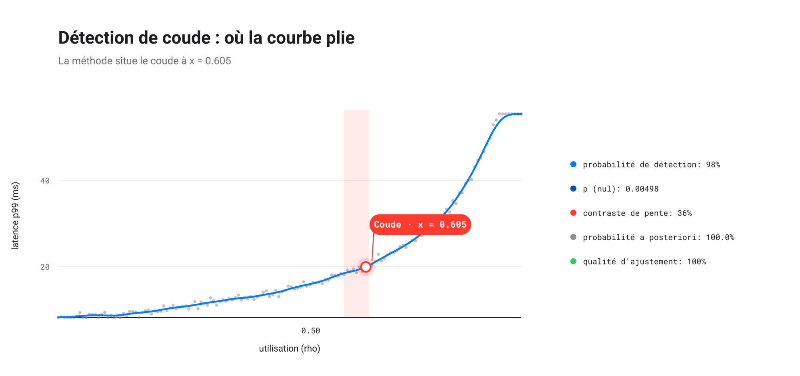
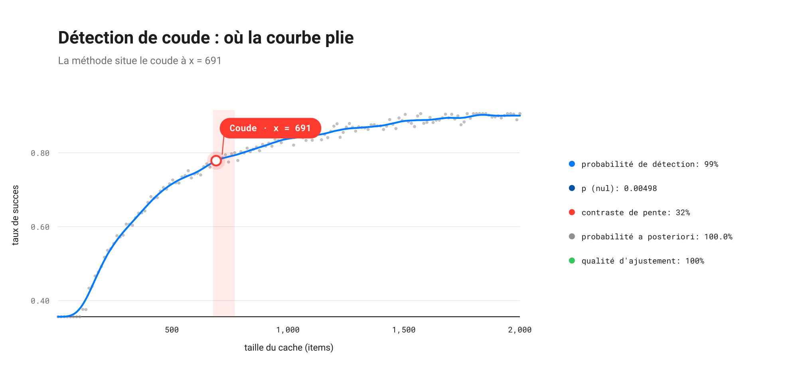
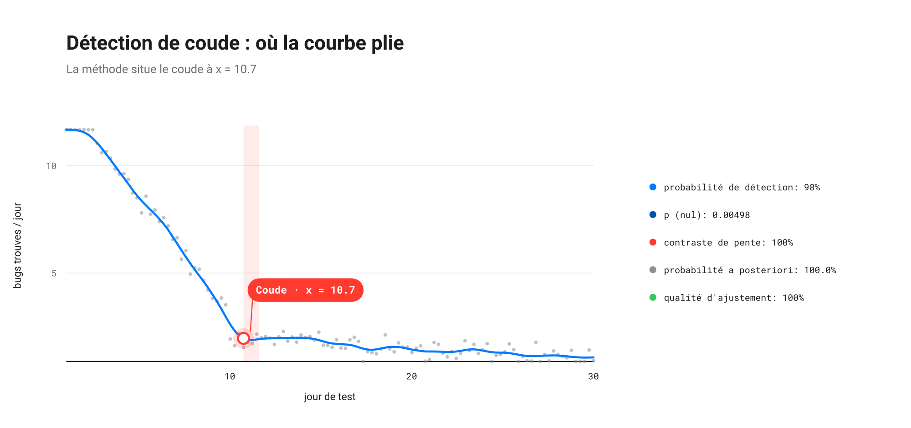

# EXEMPLES.md

Des recettes exécutables pour `elbow-helper`. Chacune existe aussi comme
script autonome dans `examples/` : on peut copier le code ou lancer le
fichier tel quel. Voir [`LISEZ-MOI.md`](LISEZ-MOI.md) pour la référence
complète de l'API et le pipeline sur lequel tout ceci repose.

## 1. Un coude net, à saturation

Le cas le plus courant : une courbe qui monte, plie, puis s'aplatit, avec
assez de signal pour que le pipeline s'engage sur une estimation ponctuelle.

```python
import numpy as np
from elbow_helper import RobustKneeConfig, robust_knee

rng = np.random.default_rng(1)
x = np.linspace(0.0, 1.0, 80)
knee = 0.30
y = np.where(x <= knee, 3.0 * x, 3.0 * knee + 0.2 * (x - knee))
y = y / y.max() + rng.normal(0, 0.02, x.size)

result = robust_knee(
    x, y, curve="concave", direction="increasing",
    config=RobustKneeConfig(random_seed=0),
)

print(result)
if result.is_clear:
    print(f"  true knee ~ {knee}, located at {result.knee_x:.3f}")
    print(f"  90% CI    = ({result.ci90[0]:.3f}, {result.ci90[1]:.3f})")
    print(f"  detection = {result.detection_rate:.2f}, null p = {result.null_p_value:.3g}")
```

```text
ClearKnee(knee_x=0.3418, ci90=(0.3418, 0.3797), detection_rate=0.98, null_p=0.00498)
  true knee ~ 0.3, located at 0.342
  90% CI    = (0.342, 0.380)
  detection = 0.98, null p = 0.00498
```

L'estimation ponctuelle ne voyage jamais seule : `ci90` l'encadre,
`detection_rate` indique la fréquence à laquelle un rééchantillonnage
indépendant du bruit retrouve le même coude ; `null_p_value` dit à quel
point ce coude serait surprenant si la courbe n'était en réalité qu'une
droite plus du bruit.

Script complet : [`examples/clear_knee.py`](examples/clear_knee.py).

## 2. Le « coude » de k-means (convexe, décroissant)

`robust_elbow` est `robust_knee` avec `curve`/`direction` figés sur la forme
classique d'un graphe d'éboulis : l'inertie chute vite, puis s'aplatit à
mesure que les groupes supplémentaires cessent d'être rentables.

```python
import numpy as np
from elbow_helper import RobustKneeConfig, robust_elbow

rng = np.random.default_rng(3)
k = np.arange(1, 41, dtype=float)
inertia = np.where(k <= 8, 1000 - 90 * k, 280 - 3 * (k - 8))
inertia = inertia + rng.normal(0, 4.0, k.size)

result = robust_elbow(k, inertia, config=RobustKneeConfig(random_seed=0))

print(result)
if result.is_clear:
    print(f"  elbow at k = {result.knee_x:.1f}  (true k = 8)")
    print(f"  90% CI     = ({result.ci90[0]:.1f}, {result.ci90[1]:.1f})")
```

```text
ClearKnee(knee_x=9, ci90=(9, 11.5), detection_rate=1.00, null_p=0.00498)
  elbow at k = 9.0  (true k = 8)
  90% CI     = (9.0, 11.5)
```



Script complet : [`examples/kmeans_elbow.py`](examples/kmeans_elbow.py).

## 3. Abstention explicite, pas un faux coude

Une droite bruitée mais réellement monotone n'a pas de coude. Le pipeline le
signale, avec un motif exploitable par un programme, plutôt que de renvoyer
un point plausible en apparence mais illusoire.

```python
import numpy as np
from elbow_helper import RobustKneeConfig, robust_knee

rng = np.random.default_rng(2)
x = np.linspace(0.0, 1.0, 80)
y = 0.2 + 0.5 * x + rng.normal(0, 0.01, x.size)  # monotone, no knee

result = robust_knee(
    x, y, curve="concave", direction="increasing",
    config=RobustKneeConfig(random_seed=0),
)

print(result)
print(f"  reason = {result.reason}")
```

```text
NoClearKnee(reason='NO_PERSISTENT_CLUSTER')
  reason = NO_PERSISTENT_CLUSTER
```

Chaque abstention porte l'un des quinze codes documentés dans la section
« Codes d'abstention » du LISEZ-MOI ; `result.diagnostics` conserve la trace
numérique complète derrière la décision, utile pour ajuster
`RobustKneeConfig` sur votre propre famille de courbes.

Script complet : [`examples/no_knee.py`](examples/no_knee.py).

## 4. Une courbe à saturation : `1 - exp(-t / tau)`

Tensions de charge, courbes d'apprentissage, courbes dose-réponse : tout ce
qui monte vite puis approche asymptotiquement un plafond partage cette
forme. C'est un bon test de robustesse : contrairement à un coude formé de
deux segments droits, cette courbe n'a pas de vraie rupture de pente, elle
est lisse partout.

```python
import numpy as np
from elbow_helper import RobustKneeConfig, robust_knee

tau = 1.0
rng = np.random.default_rng(4)
t = np.linspace(0.0, 5.0 * tau, 150)
y = 1.0 - np.exp(-t / tau)
y = y + rng.normal(0, 0.01, t.size)

result = robust_knee(
    t, y, curve="concave", direction="increasing",
    config=RobustKneeConfig(random_seed=0),
)

print(result)
if result.is_clear:
    print(f"  knee at t = {result.knee_x:.3f}  (tau = {tau})")
```

```text
ClearKnee(knee_x=1.980, ci90=(1.946, 2.114), detection_rate=0.99, null_p=0.00498)
  knee at t = 1.980  (tau = 1.0)
```

Un point à garder en tête avant de trop lire dans le chiffre exact : le
coude repéré se situe systématiquement autour de **1,9 tau**, pas 1 tau. La
« constante de temps » des manuels marque `1 - e^-1 ≈ 63 %` de la montée :
mathématiquement propre, mais pas l'endroit où une courbe se lit visuellement
comme « aplatie ». Le pipeline (comme un œil humain) se règle sur environ
deux constantes de temps (`1 - e^-2 ≈ 85 %`), la même convention informelle
de « pratiquement stabilisé » utilisée en électronique RC et en théorie du
contrôle. Ce ratio est autant une propriété de la *fenêtre d'observation* que
de la courbe elle-même : mesuré ici sur `t ∈ [0, 5·tau]`, il se déplacerait
sous une fenêtre plus étroite ou plus large, puisque la décision porte sur
l'écart maximal à la corde qui traverse l'intervalle réellement fourni, pas
sur une propriété intrinsèque de la courbe infinie.



Script complet : [`examples/exponential_saturation.py`](examples/exponential_saturation.py).

## 5. Latence de file d'attente : un coude de dimensionnement

Le temps de réponse d'une file à un seul serveur croît comme `1 / (1 - rho)`
en fonction de son taux d'utilisation `rho`, une explosion classique de type
M/M/1. Cette courbe est convexe et croissante, à la différence des formes
concaves et saturantes vues plus haut : le coude marque ici non pas un
plafond mais une accélération, le point à partir duquel un peu de charge en
plus coûte beaucoup plus de latence.

```python
import numpy as np
from elbow_helper import RobustKneeConfig, robust_knee

baseline_ms = 8.0
rng = np.random.default_rng(7)
rho = np.linspace(0.02, 0.90, 150)
latency_ms = baseline_ms / (1.0 - rho)
latency_ms = latency_ms + rng.normal(0, 0.6, rho.size)

result = robust_knee(
    rho, latency_ms, curve="convex", direction="increasing",
    config=RobustKneeConfig(random_seed=0),
)

print(result)
if result.is_clear:
    knee_latency = baseline_ms / (1.0 - result.knee_x)
    print(f"  knee at utilization = {result.knee_x:.3f}  ({result.knee_x:.0%} of capacity)")
    print(f"  latency at knee     = {knee_latency:.1f} ms  ({knee_latency/baseline_ms:.1f}x baseline)")
```

```text
ClearKnee(knee_x=0.6047, ci90=(0.5634, 0.6106), detection_rate=0.98, null_p=0.00498)
  knee at utilization = 0.605  (60% of capacity)
  latency at knee     = 20.2 ms  (2.5x baseline)
```



Le coude tombe à 60 % d'utilisation, bien avant l'explosion mathématique à
100 %, pour environ 2,5 fois la latence de base. Une file paie déjà une taxe
réelle à 60 % d'utilisation : la courbe ne semble plate jusque-là que parce
que `1 / (1 - rho)` reste encore petit en valeur absolue.

Script complet : [`examples/queueing_latency.py`](examples/queueing_latency.py).

## 6. Dimensionner un cache : rendements décroissants

Quelle taille donner à un cache ? Pour un jeu de données actif dont la
popularité suit à peu près une loi de puissance, le taux de succès en
fonction de la taille du cache `C` suit une forme de Michaelis-Menten,
`C / (C + K)`, où `K` est la taille de cache à laquelle la moitié du jeu de
données actif est déjà résidente. Concave et croissante, comme
`1 - exp(-t/tau)` plus haut, mais construite à partir d'une fonction
rationnelle plutôt que d'une exponentielle.

```python
import numpy as np
from elbow_helper import RobustKneeConfig, robust_knee

K = 200.0
rng = np.random.default_rng(11)
cache_size = np.linspace(10, 2000, 150)
hit_rate = cache_size / (cache_size + K)
hit_rate = hit_rate + rng.normal(0, 0.01, cache_size.size)

result = robust_knee(
    cache_size, hit_rate, curve="concave", direction="increasing",
    config=RobustKneeConfig(random_seed=0),
)

print(result)
if result.is_clear:
    print(f"  knee at cache size = {result.knee_x:.0f} items  ({result.knee_x/K:.2f}x K)")
```

```text
ClearKnee(knee_x=691.1, ci90=(677.8, 771.3), detection_rate=0.99, null_p=0.00498)
  knee at cache size = 691 items  (3.46x K)
```



Le coude tombe autour de `3,5 * K`, pas à `K` lui-même. `K` ne marque que le
point de 50 % de succès, une propriété de l'algèbre de la formule, pas
l'endroit où le retour *marginal* sur la taille du cache cesse réellement
d'être rentable.

Script complet : [`examples/cache_hit_rate.py`](examples/cache_hit_rate.py).

## 7. Quand arrêter les tests

Les modèles de croissance de fiabilité décrivent la découverte de défauts
pendant les tests comme rapide au début (les bogues faciles, à fort impact)
puis lente (les bogues rares, profonds) : une courbe qui chute fortement,
plie, puis s'étire en une longue traîne basse. La même famille
convexe/décroissante que les exemples de k-means et d'ACP, appliquée cette
fois à une question d'ingénierie de mise en production plutôt que de
regroupement ou de réduction de dimension.

```python
import numpy as np
from elbow_helper import RobustKneeConfig, robust_knee

true_knee_day = 10.0
rng = np.random.default_rng(13)
days = np.linspace(1, 30, 120)
bugs_per_day = np.where(
    days <= true_knee_day,
    14.0 - 1.1 * days,
    2.0 - 0.05 * (days - true_knee_day),
)
bugs_per_day = np.clip(bugs_per_day + rng.normal(0, 0.3, days.size), 0, None)

result = robust_knee(
    days, bugs_per_day, curve="convex", direction="decreasing",
    config=RobustKneeConfig(random_seed=0),
)

print(result)
if result.is_clear:
    print(f"  knee at day = {result.knee_x:.1f}  (true knee = {true_knee_day:.0f})")
```

```text
ClearKnee(knee_x=10.75, ci90=(10.75, 11.6), detection_rate=0.98, null_p=0.00498)
  knee at day = 10.7  (true knee = 10)
```



Le coude repéré se situe environ un jour après la vraie rupture, le même
petit décalage systématique « un à deux pas au-delà du vrai plissement » que
montre l'exemple du graphe d'éboulis de l'ACP dans `doc/ELBOW-en.tex`
(les notes mathématiques sont uniquement en anglais). Lire
`knee_x` comme « arrêter les tests exactement ici » plutôt que « le taux de
découverte s'est désormais vraiment aplati, à un jour ou deux près » accorde
à l'estimation ponctuelle plus de crédit qu'elle n'en revendique.

Script complet : [`examples/bug_discovery_rate.py`](examples/bug_discovery_rate.py).

## 8. La figure de diagnostic

`elbow_helper.plotting` ne demande aucune installation supplémentaire : elle
écrit un SVG autonome à la main, sans matplotlib.

```python
from elbow_helper import RobustKneeConfig
from elbow_helper.plotting import plot_diagnostics

plot_diagnostics(
    x, y, curve="concave", direction="increasing",
    config=RobustKneeConfig(random_seed=0),
    out="diagnostics.svg",
    language="en",   # or "fr"
)
```

La figure montre la courbe avec son coude repéré et sa bande d'IC à 90 %
(ou, en cas d'abstention, une courbe grisée en pointillés et le motif), à
côté d'une légende compacte des preuves : probabilité de détection,
p-valeur du modèle nul, contraste de pente, une probabilité postérieure du
modèle dérivée du BIC, une lecture bornée dans `[0, 1]` (par exemple
« 99,9 % ») et non les unités de nats brutes et non bornées que renvoie
directement `bic_improvement`, puisqu'un écart brut de log-vraisemblance n'a
pas d'échelle naturelle à laquelle se comparer, ainsi qu'un score de qualité
d'ajustement normalisé contre un pire cas délibérément pessimiste (le point
observé le plus difficile à prédire à partir de tous les autres) plutôt que
contre la moyenne de l'échantillon, qu'un ajustement réel peut trop
facilement dépasser en médiocrité. Voir `doc/ELBOW-en.tex` pour la
dérivation des deux normalisations.

Script complet : [`examples/diagnostic_plot.py`](examples/diagnostic_plot.py).

## 9. Le repéreur autonome

Le repéreur de pic géométrique, réécrit de zéro, qui sous-tend `robust_knee`
s'utilise aussi seul, sans le pipeline conservateur complet (pas de
bootstrap, pas de test contre un modèle nul, pas de regroupement par
persistance : juste l'étape géométrique de repérage) :

```python
from elbow_helper import KneeLocator

kl = KneeLocator(x, y, S=1.0, curve="concave", direction="increasing", online=True)
kl.knee, kl.all_knees
```

Utile pour explorer une courbe de façon interactive ou comme brique dans
votre propre pipeline ; `robust_knee` reste le bon choix quand il faut
l'estimation d'incertitude et la garantie d'abstention.

## 10. Régler la configuration

Chaque seuil vit dans `RobustKneeConfig`, une dataclass figée. Les valeurs
par défaut du paquet privilégient la vitesse (des comptes de réplicats
modestes, une exécution qui se termine en quelques secondes) ; augmentez-les
pour une exécution de qualité validation :

```python
from elbow_helper import RobustKneeConfig

config = RobustKneeConfig(bootstrap_replicates=100, null_replicates=200)
validation_config = config.with_(bootstrap_replicates=500, null_replicates=1000)
```

`cluster_tolerance` et `max_neighbor_shift` sont les deux seuils les plus
utiles à recalibrer sur vos propres données : ils se placent légèrement
au-dessus de la valeur de référence 0,05 pour absorber la gigue de
discrétisation du repéreur aux tailles d'échantillon modestes (n autour de
60 à 100), resserrez-les pour des jeux de données plus propres et plus
grands, desserrez-les pour des jeux plus bruités ou plus courts.
