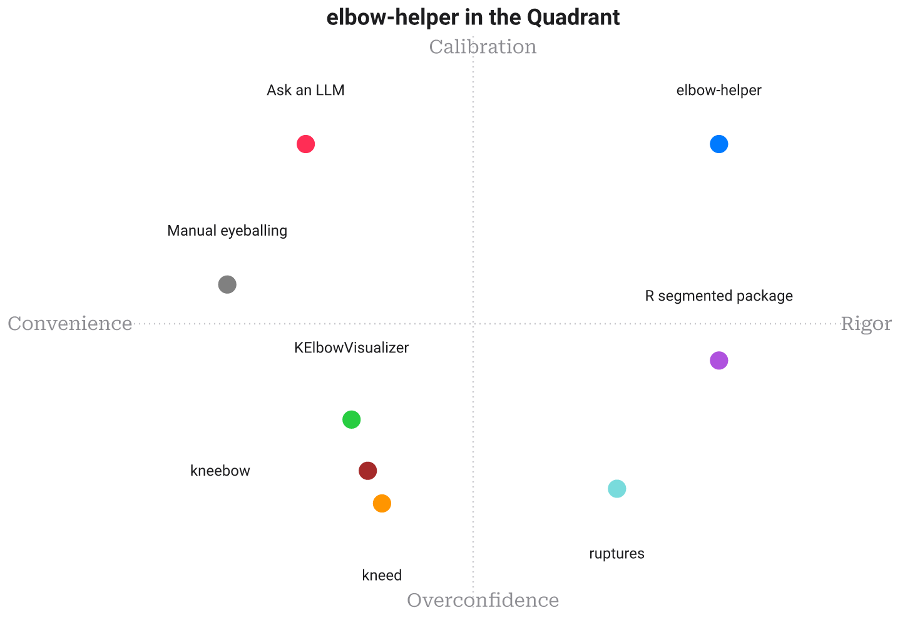

# Landscape

[🇫🇷](PAYSAGE.md)&nbsp;&nbsp;|&nbsp;&nbsp;[🇬🇧](LANDSCAPE.md)

How `elbow-helper` compares to *every other way of finding a knee*. Each approach is rated on **this project's job — reporting a knee only when the evidence supports it, and saying so explicitly otherwise** — not penalised for excelling at a different job (raw changepoint detection, exploratory visualization, statistical inference in R).

## Positioning

`elbow-helper` does not compete with `ruptures` on multi-breakpoint search or with a statistician's judgement on a well-understood dataset. It answers a narrower, harder question: given one curve and no other context, is any candidate knee strong enough to trust? Most of the field either always returns a point estimate (`kneed`, `kneebow`, Yellowbrick's `KElbowVisualizer`) or asks a human to supply the judgement `elbow-helper` automates (manual eyeballing, an LLM prompt). Its closest analogue is not another knee locator but R's `segmented` package, which shares the same instinct: a knee claim should come with a standard error, not just a coordinate.

## At a glance

| Elbow Detection Tool | Noise Robustness | Automatic Shape Inference | Explicit Abstention | Multiple Breakpoints | Statistical Significance Testing | Uncertainty Quantification | Model-Selection Rigor | Dependency Footprint | One-Call Ease of Use | Reproducibility | Published Math/Derivation |
| --- | --- | --- | --- | --- | --- | --- | --- | --- | --- | --- | --- |
| **elbow-helper** | ⭐⭐⭐⭐⭐ | ⭐⭐⭐⭐⭐ | ⭐⭐⭐⭐⭐ | ⭐⭐⭐⭐⭐ | ⭐⭐⭐⭐⭐ | ⭐⭐⭐⭐⭐ | ⭐⭐⭐⭐⭐ | ⭐⭐⭐⭐⭐ | ⭐⭐⭐⭐ | ⭐⭐⭐⭐⭐ | ⭐⭐⭐⭐⭐ |
| **kneed** | ⭐⭐ | ⭐⭐ | ⭐ | ⭐⭐ | ⭐ | ⭐ | ⭐ | ⭐⭐⭐⭐ | ⭐⭐⭐⭐⭐ | ⭐⭐⭐⭐⭐ | ⭐⭐⭐ |
| **ruptures** | ⭐⭐⭐ | ⭐ | ⭐⭐ | ⭐⭐⭐⭐⭐ | ⭐⭐ | ⭐ | ⭐⭐⭐ | ⭐⭐⭐ | ⭐⭐⭐ | ⭐⭐⭐⭐⭐ | ⭐⭐⭐⭐ |
| **kneebow** | ⭐⭐ | ⭐⭐⭐ | ⭐ | ⭐ | ⭐ | ⭐ | ⭐ | ⭐⭐⭐⭐⭐ | ⭐⭐⭐⭐ | ⭐⭐⭐⭐⭐ | ⭐⭐ |
| **KElbowVisualizer** | ⭐⭐ | ⭐⭐⭐ | ⭐⭐ | ⭐ | ⭐ | ⭐ | ⭐ | ⭐ | ⭐⭐⭐⭐⭐ | ⭐⭐⭐⭐ | ⭐⭐⭐ |
| **R segmented package** | ⭐⭐⭐ | ⭐⭐ | ⭐⭐ | ⭐⭐⭐⭐ | ⭐⭐⭐⭐ | ⭐⭐⭐⭐ | ⭐⭐⭐ | ⭐⭐ | ⭐⭐ | ⭐⭐⭐⭐ | ⭐⭐⭐⭐⭐ |
| **Manual eyeballing** | ⭐ | ⭐ | ⭐⭐⭐ | ⭐⭐ | ⭐ | ⭐ | ⭐ | ⭐⭐⭐⭐⭐ | ⭐⭐⭐⭐⭐ | ⭐ | ⭐ |
| **Ask an LLM** | ⭐⭐ | ⭐⭐⭐⭐ | ⭐⭐⭐ | ⭐⭐⭐ | ⭐ | ⭐⭐ | ⭐ | ⭐⭐ | ⭐⭐⭐⭐⭐ | ⭐⭐ | ⭐ |

## Per-tool write-up

### kneed
The reference implementation of the Kneedle algorithm `elbow-helper`'s own locator is ported from, credited in the Acknowledgements section of the README. Excellent at the one thing it does: given a curve and an explicit `curve`/`direction`, it returns a single point, deterministically, in one line of code. It carries no notion of confidence and no path to "there is no knee here" beyond an unhelpful `None`. `elbow-helper` wraps this exact geometric idea in the confirmation machinery kneed leaves to the caller.

### ruptures
The right tool when the question is genuinely "how many breakpoints and where" over a signal, with PELT, binary segmentation, and window-based search all built in. It is agnostic to what a "knee" even means, so a diminishing-returns curve and a mean-shift in noise are the same kind of object to it. `elbow-helper`'s own multi-knee research (`research/multiknee/`) tests the same PELT-adjacent dynamic program `ruptures` uses, adding the model-selection layer (mBIC, FWER) `ruptures` leaves to the user to configure.

### kneebow
A small, dependency-light package built around the same rotation idea Kneedle uses, geometric and fast. Like kneed, it commits to an answer on every call, with no smoothing-scale search, no bootstrap, and no null-hypothesis check behind the number it returns.

### Yellowbrick KElbowVisualizer
The most popular way practitioners actually find k-means's elbow: fit for several k, plot the inertia curve, eyeball or auto-locate the bend. It is a visualization tool wearing a locator's hat, built for one specific curve shape (convex, decreasing) rather than the general knee/elbow problem. It also inherits scikit-learn and matplotlib as hard dependencies. `elbow-helper`'s own k-means worked example (`MATH-en.md`, Part I) targets exactly this curve, with the confirmation chain Yellowbrick's visual read never runs.

### R segmented package
The most statistically serious alternative here: proper broken-line regression, with standard errors, Davies' test, and multi-breakpoint support (`psi`) in a mature, peer-reviewed R package. What it asks of the caller is real statistical fluency, a model formula, starting breakpoint guesses, and R itself rather than a one-line Python call. `elbow-helper` automates the parts of this workflow, smoothing-scale search, bootstrap, null test, that `segmented` leaves to a human analyst's judgement.

### Manual eyeballing
The universal baseline: look at the plot, decide where it bends. A careful analyst can genuinely say "I don't see a clear knee here", which is more than most automated tools manage, but the judgement is not reproducible across people, or even across the same person on different days. It does not scale past a handful of curves either.

### Ask an LLM
A modern variant of eyeballing: paste the data or a screenshot into a chat model and ask where the knee is. Large language models are fluent at describing shape in words and can hedge sensibly when asked to, but the answer is not deterministic across runs, carries no calibrated uncertainty, and rests on no reproducible derivation a reader could check.

## The thesis

Every alternative here is good at something `elbow-helper` does not try to be: `ruptures` at counting breakpoints, `segmented` at full statistical inference, Yellowbrick at a fast visual read, an LLM at describing a shape in plain words. What none of them do by default is refuse. `elbow-helper` exists for the narrower case where a wrong answer is worse than no answer. It treats "there is no clear knee here" as a first-class, equally well-supported result.
