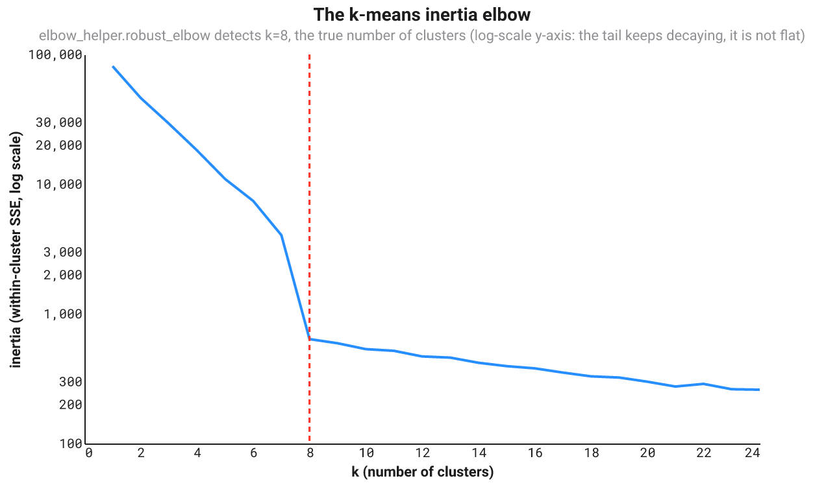
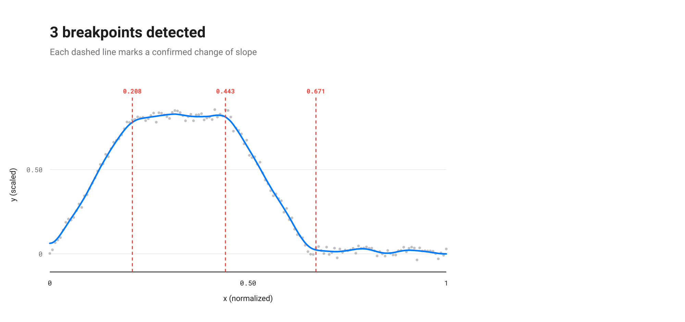
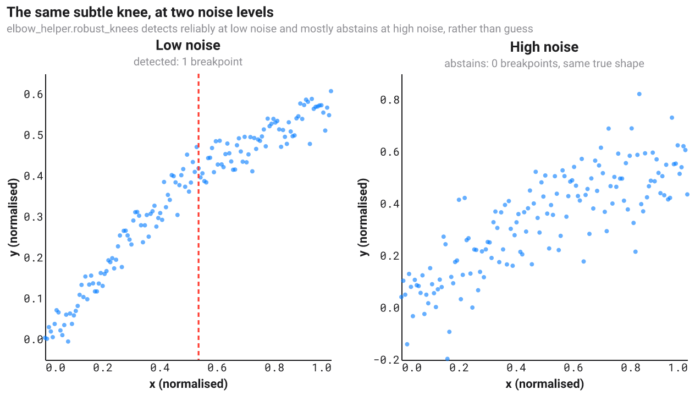
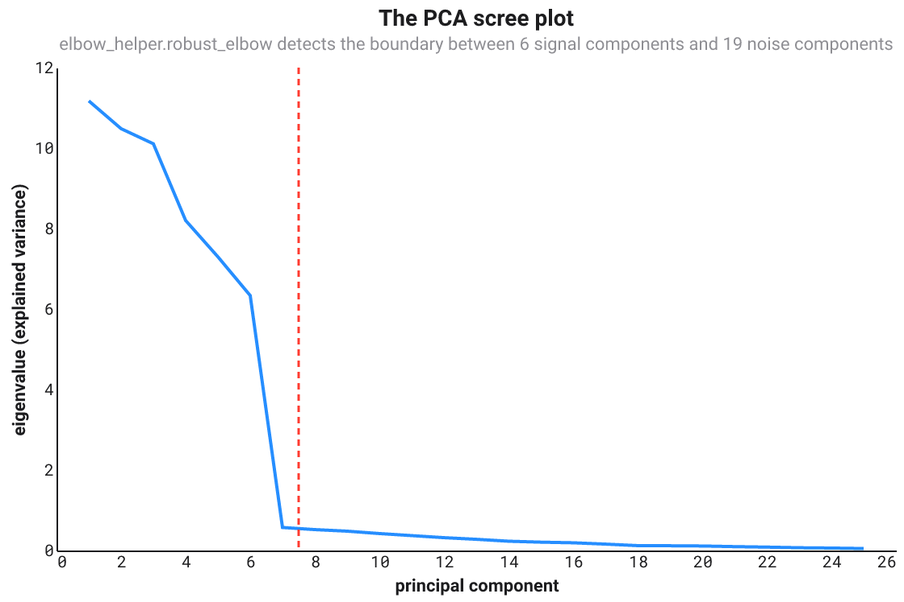

# Some Mathematics behind elbow-helper

[🇫🇷](MATH-fr.md)&nbsp;&nbsp;|&nbsp;&nbsp;[🇬🇧](MATH-en.md)

This note explains, from first principles, every piece of mathematics `elbow-helper` runs: the shipped single-knee pipeline (`robust_knee`, `robust_elbow`) and the multi-knee research behind `robust_knees`. Citations live in `references.bib`; each claim states whether it is a verified citation, a citation reported through a secondary source, or this project's own construction, following the evidence-marking convention used throughout this project.

**How to read this note.** Every concept gets the same treatment: first a plain-language explanation with a concrete example, assuming nothing beyond high-school algebra; then the precise formula, for a reader who wants to check every step, including a reader with a Ph.D. in applied mathematics who wants to verify the derivation rather than trust the prose. Skip the formula blocks on a first pass if the intuition already answers your question. Come back to them when it doesn't.

The note is organized around a single question, asked three times with increasing realism: what does *one* knee mean geometrically (Part I), what does *several* knees mean geometrically (Part II), and how do you trust either answer once the data is noisy (Part III)?

## Part I: one knee, the geometry of a bend

### 1. Putting the data on common ground: normalization

**Intuition.** A curve of website visits over months and a curve of stock prices over years look nothing alike numerically: one might range over thousands, the other over single digits, yet both could share the same *shape*. Before comparing shapes, both axes get rescaled into the same box, the unit square $[0,1] \times [0,1]$, so every threshold used later in the pipeline, how sharp a bend counts, how much noise is too much, means the same thing regardless of the data's original units.

**Formula.** $x$ is scaled linearly:

$$x_{\text{norm}} = \frac{x - x_{\min}}{x_{\max} - x_{\min}}$$

$y$ is scaled the same way, but using the 5th and 95th percentiles instead of the raw minimum and maximum, then clipped to $[0,1]$:

$$y_{\text{scaled}} = \operatorname{clip}\!\left(\frac{y - y_{p5}}{y_{p95} - y_{p5}},\ 0,\ 1\right)$$

The percentile choice is not cosmetic: a single wild outlier, a data-entry error, a one-off spike, would otherwise stretch the whole $y$ axis to accommodate it, crushing the real signal into a sliver near zero. Percentiles absorb a handful of extreme points without distorting the shape that matters (`src/elbow_helper/preprocessing.py`).

### 2. The Kneedle bump: what "knee" means, exactly

**Intuition.** A textbook knee, shaped like $\sqrt{x}$, rises fast then levels off. Subtracting the straight diagonal line joining the curve's two endpoints from the curve itself produces a bump: it starts at zero, peaks somewhere in the middle, and returns to zero. The peak of that bump sits exactly where the curve bends hardest away from a straight line, which is the intuitive definition of a "knee". Kneedle, due to Satopää, Albrecht, Irwin and Raghavan, turns this picture into an algorithm: subtract the diagonal, find the bump's peak, call it the knee. `elbow-helper`'s `kneedle.py` is a from-scratch NumPy port; see the project's `README.md` Acknowledgements section for the implementation's origin.

Four shapes exist in principle, concave-increasing, concave-decreasing, convex-increasing, convex-decreasing, but only one of them, concave-increasing, is the "obvious" bump-above-the-diagonal case. `elbow-helper` reorients the other three into that one case first (flip, mirror, or both, depending on `curve`/`direction`), runs the same bump-peak logic, then un-transforms the answer. This is why `curve` and `direction` matter: they tell the algorithm which of the four mirror images it is looking at.

**Formula.** After orienting to the concave-increasing frame, the difference curve is

$$d(x_i) = y_{\text{norm}}(x_i) - x_{\text{norm}, i}$$

Its local maxima are candidate knees. At each local maximum $j$, a sensitivity threshold controls how far the curve must dip below the peak before that peak is trusted as a real knee rather than a wiggle:

$$T_j = d_{\max, j} - S \cdot \overline{|\Delta x_{\text{norm}}|}$$

where $S$ is the sensitivity parameter: a larger $S$ is more conservative, demanding a bigger dip. The bar denotes the mean spacing between consecutive $x$ values. Traversing the difference curve left to right, a knee is declared at the last index before $d(x)$ drops below the currently active threshold $T_j$; in "online" mode the traversal keeps re-arming at every later, higher peak, so only the last, most persistent bump wins (`src/elbow_helper/kneedle.py`, `find_knee`) [@satopaa2011].

### 3. The broken-line model: a knee as a change of slope

**Intuition.** A real knee should let a two-piece line, straight, then a different straight slope after the knee, fit the data noticeably better than a single straight line can. `elbow-helper` builds that two-piece model as one continuous curve using a hinge function, $\max(0, x - k)$, which is exactly zero before the knee $k$ and grows linearly after it, so adding it to a plain line produces a single formula for a line that bends at $k$ without jumping:

$$y = a + b\,x + c \cdot \max(0,\ x - k)$$

This is the algebraic object every confirmation check in Part III is ultimately built around: fitting it by ordinary least squares and comparing its residual error against a plain line's answers the question "does a bend here actually help".

### 4. A worked example: the k-means inertia elbow

`robust_elbow`'s own docstring names this the flagship convex-decreasing case, and it is worth seeing end to end: run k-means for $k = 1, 2, \dots$, plot the inertia (within-cluster sum of squared distances) against $k$, and look for the point past which adding another cluster stops paying for itself.

`tests/test_real_world_examples.py::kmeans_inertia_curve` builds eight well-separated 2D blobs, each its own mildly elongated ellipse rather than a plain isotropic Gaussian, and runs Lloyd's algorithm (fifteen random restarts per $k$, to avoid a bad local optimum blurring the curve) for $k = 1, \dots, 24$. Inertia falls by two orders of magnitude at $k = 8$, the true cluster count. What happens after $k = 8$ is the point worth looking at closely: inertia keeps decaying, gently and a little unevenly, rather than snapping flat. That leftover slope is real, not noise in the plotting sense, each blob's own elongation gives a $k$ past 8 a little genuine sub-structure to exploit, exactly as a real dataset's clusters are never perfect circles either. The figure below plots inertia on a logarithmic axis for this reason: the drop at $k=8$ is so much larger than the tail's own gentle decay that a linear axis would flatten the tail to the eye even though the underlying numbers keep falling.

**Two practical traps this example surfaced, worth stating plainly.** First: a k-means inertia curve has one point per candidate $k$, rarely more than a couple of dozen, and its genuine elbow usually sits close to the *left* edge, at a small $k$, not in the middle. `elbow-helper`'s defaults (Sections 10 through 16) are calibrated for longer, noisier, elbow-anywhere measurement curves: `min_samples=20` and `min_side_points=5` reject a short, left-heavy curve like this one outright. `tests/test_real_world_examples.py` ships a `RobustKneeConfig` profile with both of those relaxed, plus several of the persistence and bootstrap thresholds loosened to match, and states in a comment exactly why: short, clean applied curves are a genuinely different regime from the long, noisy time-series-like curves the defaults target, not a bug in either. Second: blocked cross-validation (Section 14) splits a curve this short, about 25 points, into `cv_folds` contiguous pieces, and the default of 5 folds leaves so few points per fold that a fold boundary landing near the elbow can flip the sign of the held-out improvement on an unlucky seed. Three wider folds instead of five fixes it, a direct, checkable illustration of Section 14's own point that cross-validation needs enough data per fold to say anything stable.

## Part II: several knees, the geometry of many bends

### 5. The model: independent linear segments

**Intuition.** Cut the curve into pieces at $k$ breakpoints and fit each piece its own straight line, independently, allowing a visible jump at each cut rather than forcing the pieces to meet exactly. This is a deliberate departure from Part I's continuous hinge model: once more than one breakpoint is free to move, a *continuous* piecewise-linear fit no longer decomposes into a sum of independent per-piece costs, moving one breakpoint changes the boundary condition every neighbouring piece must satisfy. That dependency breaks the efficient search algorithms below. The changepoint literature this section draws on and tests, Yao, Zhang and Siegmund, PELT, binary segmentation, is stated for independent segments, so matching that model is what makes the comparison a fair test of *their* claims, not a test of a different model wearing their name.

### 6. Segment cost, in closed form

**Intuition.** Fitting a straight line through a handful of points and measuring how well it fits, the residual sum of squares (RSS), sounds like it should be done point by point, but a shortcut exists: once five running totals are known, a sum of $x$'s, of $y$'s, of $x^2$'s, of $xy$'s, of $y^2$'s, the best-fit line's RSS for *any* stretch of points can be computed in one step, without touching the individual points again. Precomputing those totals once, then reading off any segment's cost instantly, is what makes searching over thousands of ways to cut the curve computationally realistic.

**Formula.** For a segment covering $m$ points with values $x_1, \dots, x_m$ and $y_1, \dots, y_m$, let

$$S_1 = m,\quad S_x = \sum_i x_i,\quad S_y = \sum_i y_i,\quad S_{xx} = \sum_i x_i^2,\quad S_{xy} = \sum_i x_i y_i,\quad S_{yy} = \sum_i y_i^2$$

The least-squares slope and intercept of $y = a + bx$ are

$$b = \frac{m\,S_{xy} - S_x S_y}{m\,S_{xx} - S_x^2}, \qquad a = \frac{S_y - b\,S_x}{m}$$

and, substituting into $RSS = \sum_i (y_i - a - b x_i)^2$ and simplifying with the normal equations,

$$RSS = S_{yy} - a\,S_y - b\,S_{xy}$$

Precomputing the six running sums once costs $O(n)$; every later segment-cost lookup then costs $O(1)$. This is standard practice in changepoint software, a direct algebraic consequence of the least-squares normal equations, not a result that needs its own citation.

### 7. Optimal partitioning: the dynamic program

**Intuition.** Choosing the single best way to place $k$ breakpoints among $n$ points by trying every combination would be astronomically slow. Dynamic programming avoids this by building the answer from smaller sub-answers: the cheapest way to explain the first $t$ points with $k$ segments is, for every possible location of the last cut $s$, the cheapest way to explain the first $s$ points with $k-1$ segments, plus the cost of one final segment from $s$ to $t$, minimized over all valid $s$. Because the best $k$-segment answer depends only on the best $(k-1)$-segment answers, each already computed once, no combination is ever recomputed. This is Bellman's principle of optimality.

**Formula.** With $C[k][t]$ the minimal total RSS of the first $t$ points cut into $k+1$ segments:

$$C[0][t] = \operatorname{cost}(0, t)$$

$$C[k][t] = \min_{s} \Big( C[k-1][s] + \operatorname{cost}(s, t) \Big)$$

where $s$ ranges over cut points that leave every segment at least `min_seg` points long. Solving this for every $k$ up to $k_{\max}$ and every $t$ up to $n$ costs $O(k_{\max} \cdot n^2)$, each cell an $O(n)$ minimization over $O(1)$ segment costs from Section 6. Backpointers recover the actual cut positions. `research/multiknee/tests/test_segmentation.py::test_dp_matches_brute_force_small_n` checks this against literal enumeration of every valid partition on small inputs, so its correctness is verified empirically, not just asserted from the textbook recursion [@cormen2022algorithms].

This is the same recursion underlying Yao [-@yao1988], Zhang and Siegmund [-@zhangsiegmund2007], and PELT, "Pruned Exact Linear Time", due to Killick, Fearnhead and Eckley [-@killick2012]. PELT is this recursion with a pruning step added that provably never removes the optimum for an additive penalty, so it returns identical answers, only faster. No separate PELT implementation was built for that reason: it would reproduce these numbers exactly.

### 8. Greedy binary segmentation: the faster, worse alternative

**Intuition.** Instead of solving the whole problem exactly, repeatedly make the single best choice available right now: find the one split that most reduces the *global* error, commit to it, then repeat on the two resulting pieces. This is much faster than the dynamic program, but it can only ever produce worse or equal outcomes, never better, because it locks in early decisions before later evidence exists to correct them.

**A concrete failure, not a hypothetical one.** `research/multiknee/tests/test_segmentation.py::test_greedy_can_strictly_underperform_dp_even_when_noiseless` exhibits a noiseless curve with two sharp, real breakpoints where greedy's *first* split lands on neither of them; by the time greedy adds a second split, it still has strictly higher error than the dynamic program's exact, zero-error optimum. `research/multiknee/RESULTS.md` measures the downstream consequence directly: every DP-based method beats its greedy counterpart. Greedy's early-commitment errors specifically cause it to *overselect* the number of breakpoints at low noise, since fixing greedy's own placement mistake later looks, to a model-selection criterion, like genuine extra structure worth an extra breakpoint. This is the textbook motivation for Wild Binary Segmentation [@fryzlewicz2014].

### 9. A worked example: a mountain of alternating slopes

Part I's `robust_knee` needs `curve`/`direction` to know which of the four mirror images it is looking at, or must infer it from the whole curve's global shape. A curve that goes up, flattens, comes back down, and flattens again, a mountain, has no single global shape at all: Section 4's fixed-sign geometry cannot describe it, no matter how `curve`/`direction` are set.

`robust_knees` sidesteps the question entirely, because Section 5's independent-segment model never assumes a shared sign for the slopes in the first place: each segment gets its own free slope, so a sign change from one segment to the next is not a special case, just what the data happens to show.

`tests/test_multiknee.py::alternating_slope_curve` builds exactly this: steep up, flat, steep down, flat, four segments and three breakpoints, each a genuine sign or magnitude change. `robust_knees` recovers all three, in the right order, with the right signs, on every seed tested.

## Part III: one or several knees, with noise

Parts I and II describe the geometry of a bend as if the data were exact. Real data never is, so nothing above is trusted on its own. This part is the trust layer: a chain of independent checks a single-knee candidate must survive to become a `ClearKnee`, and a set of model-selection criteria that decide, for the multi-knee case, how many breakpoints the noise actually supports.

### 10. Is there even a trend? Spearman rank correlation

**Intuition.** Before hunting for a knee, `elbow-helper` checks a more basic question: does $y$ move consistently with $x$ at all? Not "is the relationship a straight line", Pearson correlation asks that and would be fooled by a genuine, curved knee shape, but "when $x$ goes up, does $y$ tend to go up too, or down, however wiggly the path". The trick is to replace every value by its *rank*, 1st smallest, 2nd smallest, and so on, before correlating. Ranks discard exactly the information that would make an ordinary correlation sensitive to the curve's exact shape or to outliers, keeping only the "does the order agree" question.

**Worked example.** Five points with $x = (1,2,3,4,5)$ and $y = (2,1,5,3,9)$. The $y$ ranks are $(2,1,3,4,5)$ (rank 1 is the smallest value, so $y=1$ at position 2 gets rank 1, and so on). Even though the raw values wiggle ($2, 1, 5, \dots$), the ranks track $x$'s ranks $(1,2,3,4,5)$ fairly closely, giving a high positive correlation despite the local dip.

**Formula.** With $r_i, s_i$ the ranks of $x_i, y_i$ (ties get the average rank of the tied group):

$$\rho = \frac{\sum_i (r_i - \bar r)(s_i - \bar s)}{\sqrt{\sum_i (r_i - \bar r)^2}\ \sqrt{\sum_i (s_i - \bar s)^2}}$$

`elbow_helper.numerics.spearman` implements this directly (no `scipy.stats.rankdata` dependency). A knee candidate is only screened in if $|\rho|$ clears `config.min_spearman_abs` (default $0.60$) and a magnitude-weighted "how much of the movement fights the claimed direction" check also passes; see `INCOMPATIBLE_GLOBAL_SHAPE` in the README's abstention-reason list [@spearman1904].

### 11. Not trusting one scale: the smoothing × sensitivity search

**Intuition.** Look at a noisy curve at native resolution and every little wiggle looks like a candidate knee. Smooth it heavily and a real knee can get blurred away entirely. Neither extreme is trustworthy alone, so `elbow-helper` runs Kneedle across a whole grid: several Gaussian smoothing widths, from $1$, no smoothing, up to roughly a quarter of the data, crossed with several sensitivities $S$. Every run that finds a knee contributes one candidate to a pool; nothing is trusted yet, this stage only *proposes*.

### 12. Only count it if it survives everywhere: persistence clustering

**Intuition.** A genuine knee should show up at nearly every smoothing width and every sensitivity, wandering only slightly. A knee that is really noise tends to jump around unpredictably as the smoothing changes, or shows up at only one or two settings and vanishes elsewhere. `elbow-helper` groups the candidate pool by location, within `cluster_tolerance` of each other, in normalized $x$ units, then asks of the largest group: does it span several *consecutive* smoothing scales, does it show up across most sensitivities, is its spread (median absolute deviation) tight? If two groups are both large and comparably supported, the pipeline explicitly refuses to pick a winner (`MULTIPLE_PLAUSIBLE_KNEES`), rather than guess (`src/elbow_helper/clustering.py`).

### 13. Confirming the slope: the Theil-Sen contrast

**Intuition.** The ordinary way to estimate a slope, fit a line through a bunch of points, is easily thrown off by a single bad point far from the rest. The Theil-Sen estimator sidesteps this: compute the slope between *every pair* of points, then take the median of all those slopes. A handful of bad pairs, involving an outlier, get outvoted by the majority of good pairs.

**Worked example.** Three points $(0,0), (1,1), (2,100)$, the last one a wild outlier. Pairwise slopes: $(1-0)/(1-0)=1$, $(100-0)/(2-0)=50$, $(100-1)/(2-1)=99$. The median of $\{1, 50, 99\}$ is $50$, still pulled by the outlier with only three points, but with more normal points and one outlier, the median stops moving once outliers are a minority, unlike an ordinary least-squares fit, which the outlier would dominate immediately.

**Formula.**

$$\hat\beta = \operatorname{median}_{i < j} \frac{y_j - y_i}{x_j - x_i}$$

`elbow-helper` computes this on a small window just left and just right of the candidate knee, then compares the two slopes:

$$\text{contrast} = \frac{|m_{\text{left}} - m_{\text{right}}|}{|m_{\text{left}}| + |m_{\text{right}}| + \epsilon}$$

A contrast below `config.min_slope_contrast` (default $0.30$) fails this check (`WEAK_SLOPE_CHANGE`) [@theil1950] [@sen1968].

### 14. Confirming the model: BIC and blocked cross-validation

**Intuition.** Every extra free parameter in a model can only help it fit the *training* data better, purely mechanically, whether or not it captures anything real, a model with as many parameters as data points fits perfectly and explains nothing. The Bayesian Information Criterion, Schwarz's fix for this, charges each extra parameter a fixed toll, in units of how much the log-likelihood must improve to be worth it, so that a model is only preferred if it clears that bar.

**Formula.** For a Gaussian ordinary-least-squares fit with $n$ points, $p$ free parameters (including the noise variance itself), and $RSS$ the residual sum of squares:

$$\mathrm{BIC} = n \ln\!\left(\frac{RSS}{n}\right) + p \ln n$$

Lower is better. `elbow_helper.numerics.bic` implements exactly this; the single-knee pipeline compares the $\mathrm{BIC}$ of the single line ($p = 2 + 1$) against the broken line ($p = 3 + 1$) from Section 3, requiring an improvement of at least `config.min_bic_improvement` (default $10$) [@schwarz1978] [@hastie2009esl] [@bishop2006prml].

BIC only checks whether the extra parameter is worth its penalty *on the data used to fit it*. Blocked cross-validation asks a complementary, more paranoid question: does the broken line still win when tested on data it never saw while fitting? Ordinary shuffled cross-validation would leak information here, since neighbouring points on a curve are similar, so `elbow-helper` holds out *contiguous* chunks of $x$ in turn, not random points, mimicking how the curve would look with a genuine, unseen chunk missing. This is the same validation-rigor concern Marcos López de Prado's book on financial machine learning argues for at length, in the context of ordered, sequential data [-@lopezdeprado2018financial].

### 15. Bootstrap: does the knee survive a redo?

**Intuition.** If the data collection were repeated, would the same knee show up again, or was this run's knee a fluke of this run's particular noise? Since a real redo is not available, the bootstrap simulates one: take the residuals left over after fitting the accepted broken-line model, the part of $y$ the model did not explain, resample them with replacement, add the resampled residuals back onto the fitted model to build a synthetic "redo" curve, then rerun the *entire* search on it. Repeat many times, Efron's bootstrap. A knee that shows up only in the original run, and rarely in the resampled redos, was probably a fluke.

**Formula.** For each of $B$ replicates, $y^\ast = \hat y + r^\ast$ where $r^\ast$ is a resample-with-replacement of the observed residuals. `elbow-helper` requires the knee to be redetected in at least `config.min_bootstrap_detection_rate` (default $90\%$) of replicates, with a tight, unimodal 90% interval, the 5th-95th percentile spread of the redetected locations [@efron1979] [@hastie2009esl].

### 16. The null test: could a straight line explain this by chance?

**Intuition.** The last, most skeptical check: simulate many curves that have *no* real knee at all, straight lines carrying noise at the same estimated scale as the accepted model's residuals, run the exact same search-and-confirm procedure on each, and count how often that procedure still manages to report a knee as strong as the one actually observed. If pure noise regularly produces something this strong, the observed knee is not trustworthy evidence of a real bend, it is just what noisy straight lines look like some of the time.

**Formula.** With $B = $ `config.null_replicates` (default $200$) Monte Carlo replicates and a lexicographic, search-adjusted test statistic, so a null replicate only "beats" the observed knee if it passes *the same* confirmation gates, not just a raw score:

$$p = \frac{1 + \#\{\text{null replicates at least as strong as observed}\}}{B + 1}$$

The $+1$ in numerator and denominator is the standard finite-sample correction that keeps a Monte Carlo $p$-value from ever claiming exactly zero. `elbow-helper` requires $p \le$ `config.max_null_p_value` (default $0.01$) (`src/elbow_helper/null_test.py`, whose own module docstring states this exact formula).

Only a candidate that clears every check in Sections 8 through 14 becomes a `ClearKnee`.

### 17. Plain BIC for several knees: the naive criterion and why it overselects

**Intuition.** Section 14's BIC penalizes the number of free *regression* parameters, but choosing *where* to place $k$ breakpoints among roughly $n$ possible positions is itself a form of freedom, one that plain BIC never charges for. It is as if a multiple-choice exam only docked points for wrong answers on the questions attempted, ignoring how many questions there were to choose from in the first place.

**Formula.** With $p = 2(k+1) + 1$, two regression parameters per independent segment, plus the noise variance:

$$\mathrm{BIC}(k) = n \ln\!\left(\frac{RSS(k)}{n}\right) + p \ln n$$

The consequence is not just theoretical: `RESULTS.md` measures a 27% false-positive rate for this exact criterion on data with no real breakpoints and only 0.65 overall exact-$k$ accuracy, the worst of the four criteria tested on the dynamic program's segmentations [@yao1988] [@zhangsiegmund2007].

The deeper reason plain BIC undercharges is that a breakpoint's location is not a "regular" parameter in the technical sense BIC's derivation assumes. The log-likelihood is not smooth, twice differentiable, in the location, so the location estimator does not converge at the usual $\sqrt n$ rate with a Gaussian limit; it converges faster, at rate $n$, with a limiting distribution given by the argmax of a random walk. Charging $\frac{1}{2}\ln n$ per parameter, the Laplace-approximation argument behind BIC, assumes exactly the regularity that breaks down here.

### 18. Modified BIC: Zhang and Siegmund's fix and a sign convention resolved by testing

**Intuition.** If plain BIC undercharges for the freedom to place breakpoints, the fix is to charge more, specifically to charge *more for very short or very uneven segments*, since a tiny segment offers far more placement freedom, many nearby positions all look almost as good, than a segment that spans a large, well-defined chunk of the data.

**Formula.** Zhang and Siegmund's penalty, reported here through a secondary source rather than the primary paper, is

$$\text{penalty}(k) = 3k \ln n + \sum_{j=1}^{k+1} \ln\!\left(\frac{\ell_j}{n}\right)$$

where $\ell_j$ are the resulting segment lengths. The $3$, instead of plain BIC's implicit $2$ from the two regression parameters alone, is already a stronger complexity charge on its own; the second term is always $\le 0$ and, by the concavity of $\ln$, sits closest to zero when segments are balanced and most negative when they are very uneven.

**A genuine ambiguity, resolved empirically rather than assumed.** Folding this penalty into a lower-is-better criterion by direct addition,

$$\mathrm{mBIC}_{\text{additive}}(k) = n \ln\!\left(\frac{RSS(k)}{n}\right) + 3k \ln n + \sum_{j=1}^{k+1} \ln\!\left(\frac{\ell_j}{n}\right)$$

makes the most-negative, uneven-segment case *lower* the total, so this combination *rewards* uneven segments, the opposite of the "penalizes short and uneven segments" behaviour the term is meant to have. Subtracting the same term instead,

$$\mathrm{mBIC}_{\text{subtractive}}(k) = n \ln\!\left(\frac{RSS(k)}{n}\right) + 3k \ln n - \sum_{j=1}^{k+1} \ln\!\left(\frac{\ell_j}{n}\right)$$

does penalize uneven segments, matching the literature's stated intent. Both forms are implemented and directly compared: `modified_bic_subtractive` reaches 0.85 overall accuracy and a 0% false-positive rate at $\text{true } k = 0$; `modified_bic_additive` still beats plain BIC (0.77 vs. 0.65) but leaves an 11% false-positive rate. **The subtractive form is the one shipped.**

### 19. ICL: from mixture models to changepoints, including a bug this project found and fixed

**Intuition.** Biernacki, Celeux and Govaert's Integrated Completed Likelihood, developed for choosing the number of clusters in a mixture model, adds one more consideration on top of BIC: not just "does this model fit well relative to its complexity", but "are the resulting groups actually unambiguous". Two overlapping, hard-to-tell-apart clusters are penalized even if they fit the data about as well as two clean, well-separated ones. Gilles Celeux, a co-author of the original ICL paper, later co-wrote a book-length treatment of exactly this family of methods [@bouveyron2021mbc].

For changepoints, the analogue of "which cluster does this point belong to" is "where exactly is the cut": the relevant uncertainty is over the *entire discrete segmentation*, not over individual point-to-component labels. Rigaill, Lebarbier and Robin supply the machinery: an exact, non-asymptotic posterior over every way to place $K-1$ breakpoints, via a forward-backward dynamic program structurally identical to the forward-backward algorithm of a Hidden Markov Model, run over segmentations instead of hidden states [-@rigaill2012]; Cleynen, Luong, Rigaill and Nuel build directly on this [-@cleynen2013].

**Formula.** A forward pass computes, in log space, the total likelihood mass over every valid $K$-segment partition of the first $t$ points, using the Gaussian segment log-likelihood

$$\ell\ell(i, j) = -\frac{RSS(i, j)}{2\sigma^2} - \frac{j - i}{2} \ln(2\pi\sigma^2)$$

$$\log Z_1(t) = \ell\ell(0, t), \qquad \log Z_K(t) = \log \sum_{s} \exp\!\Big( \log Z_{K-1}(s) + \ell\ell(s, t) \Big)$$

The entropy of the resulting discrete posterior over segmentations, $H(K) = \log Z_K(n) - \mathbb{E}[\ell\ell(S)]$, is estimated by Monte Carlo backward-sampling, drawing complete segmentations from the posterior and averaging their log-probabilities, rather than derived in closed form.

**A bug the tests caught, not a design choice.** The first version built here defined the score directly as $-\log Z_K(n) + H(K)$, pure integrated likelihood plus entropy, no separate complexity penalty, reasoning that the exact posterior already "contains" whatever complexity notion is needed. Testing on sixty points of pure noise falsified that: $\log Z_K(n)$ rose from 89.8 ($K=1$) to 94.7, 99.0, and 102.8 nats as $K$ grew to 4, purely from summing over combinatorially more candidate segmentations, while entropy only rose from 0 to 3.7, 5.9, and 7.9 nats over the same steps, not fast enough to cancel the growth. The resulting score kept improving as $K$ grew even on flat noise, exactly the overselection failure this whole exercise exists to avoid.

The fix follows from re-reading the mixture-model form above: ICL is *BIC plus* an entropy correction, not a replacement for BIC's own complexity penalty:

$$\mathrm{ICL}(k) = \mathrm{BIC}(k) + 2\,H(K), \qquad K = k+1$$

Retested on the same flat-noise data, this version correctly selects $k = 0$; `RESULTS.md` shows it performing in the same tier as the subtractive mBIC (0.82 vs. 0.85 overall accuracy) once corrected [@biernacki2000].

### 20. A sequential test controlling the family-wise error rate

**Intuition.** Independent of any BIC-family score, a more direct question can be asked at each step: walking the sequence of segmentations $k = 1, 2, \dots$, is the error reduction from adding breakpoint $k$ bigger than pure chance would produce? This is answered the way a permutation test answers any such question: resample what "chance" looks like many times and see how often chance alone beats what was actually observed.

**Formula.** At each step, residuals $r = y - \hat y_{k-1}$ under the accepted $(k-1)$-breakpoint model are resampled with replacement, Efron's bootstrap again, to build $B$ synthetic curves $y^\ast = \hat y_{k-1} + r^\ast$. On each, the largest possible error reduction from one more split anywhere is computed, giving a null distribution:

$$p = \frac{1 + \#\{\text{replicates with null reduction} \ge \text{observed reduction}\}}{B + 1}$$

Breakpoint $k$ is accepted only if $p \le \alpha / k_{\max}$, a Bonferroni correction across up to $k_{\max}$ sequential tests. The procedure stops at the first breakpoint that fails, so it can never "skip" a rejected breakpoint and accept a later one. Bonferroni is conservative for independent tests; these sequential tests are not independent, each conditions on the model accepted at the previous step, which keeps the true family-wise error rate, the probability of accepting at least one spurious breakpoint anywhere in the sequence, at most as large as the nominal $\alpha$, not larger.

`RESULTS.md` shows this reaching a 0% false-positive rate at $\text{true } k = 0$ and 0.82 overall accuracy, in the same tier as the subtractive mBIC and the corrected ICL. Two more rigorous alternatives were considered and not implemented: Davies' asymptotic test [-@davies1977] and the multiscale guarantee of SMUCE, "Simultaneous MUlti-scale Change-point Estimator" [@frick2014], in favour of a permutation test whose correctness is checkable directly by simulation.

### 21. Where this leaves the shipped API

`elbow_helper.robust_knees` ships exactly the combination validated above: dynamic-program search (Section 7), the subtractive-sign modified BIC as the primary criterion (Section 18), and the FWER sequential gate (Section 20) layered on top by default, taking $\min(\text{mBIC's } k,\ \text{FWER's } k)$, matching `elbow-helper`'s stated design priority of minimizing false-positive knees even at the cost of more abstentions. Plain BIC, the additive mBIC, ICL, and greedy search are kept in `research/multiknee/` as tested-and-rejected, or tested-and-costly, alternatives that justify that choice, not shipped as public configuration options, so the public API surface reflects what was actually shown to work.

### 22. A worked example: a sigmoid staircase

Every section above is either a formula or a claim checked by a test. Here is one curve, run through the actual shipped code, to see the whole chain land somewhere concrete.

A logistic sigmoid, $1/(1+e^{-\text{steepness}(x-\text{center})})$, rises smoothly from 0 to 1 around its center and has no literal breakpoint anywhere: it is infinitely differentiable, with no kink for a piecewise-linear search to latch onto in principle. Summing three sigmoids at different centers, each scaled to add one "step", builds a smooth staircase: three rises separated by flat plateaus, the kind of shape that shows up whenever several independent thresholds get crossed in sequence, three separate user cohorts each ramping up adoption in a different week, three separate sensors each saturating at a different load.

A piecewise-*linear* model, run against a smooth curve like this, cannot represent a rise with a single straight segment without either cutting a flat plateau short or cutting the rise short. The compromise `robust_knees` settles on is visible directly in the figure below: each of the three rises gets bracketed by *two* breakpoints, one where the flat plateau ends and the rise begins, one where the rise ends and the next plateau begins. Three rises, six breakpoints, no exceptions across five different noise draws tested (`tests/test_multiknee.py::test_sigmoid_staircase_brackets_each_rise_with_a_breakpoint_pair`).

One practical trap this example surfaced, worth stating plainly: the FWER gate's Bonferroni correction divides $\alpha$ by $k_{\max}$, so the smallest $p$-value the permutation test can produce, $1/(n_{\text{permutations}}+1)$, must stay below $\alpha/k_{\max}$, or the gate can never pass no matter how real the effect is. With the default $k_{\max}=4$ and $\text{fwer\_permutations}=200$, $1/201 \approx 0.005 < 0.05/4 = 0.0125$, comfortably clear. Push $k_{\max}$ up, as this six-breakpoint example needs, without also raising `fwer_permutations`, and the gate silently locks itself out: this is exactly what happened on the first attempt at this example ($k_{\max}=8$, the default 100 permutations, every single breakpoint rejected with $k=0$), caught by looking at the diagnostics rather than assuming the algorithm had failed for some more mysterious reason.

### 23. A worked example: the same subtle knee, at two noise levels

Every check in Sections 10 through 16 exists to answer one question honestly: is this knee real, or is it what noise looks like sometimes? The cleanest way to see the answer is to hold the true shape fixed and only change the noise.

`tests/test_multiknee.py::subtle_knee_curve` is deliberately unspectacular: a small, genuine slope change at $x = 0.5$, nowhere near as dramatic as the sigmoid staircase or the mountain. At low noise, `robust_knees` detects it reliably, on every seed tested. At high noise, with the identical true shape underneath, it mostly abstains, reporting zero breakpoints rather than a guess.

This is the design priority from Section 21 made visible on one curve: `elbow-helper` is built to be wrong in the honest direction. A missed real knee at high noise is a cost this library accepts deliberately; a reported knee that is really noise is the failure mode every check in Part III exists to rule out.

### 24. A worked example: the PCA scree plot

The other case `robust_elbow`'s docstring names directly: a scree plot, the eigenvalues of a covariance matrix in decreasing order, used to decide how many principal components carry real signal versus noise.

`tests/test_real_world_examples.py::pca_scree_curve` builds data with six genuine signal dimensions (large variance) buried in nineteen noise dimensions, rotated so the signal is not aligned with any one measured axis, the setting PCA itself is built to unmix. The noise dimensions are not equal-variance: their variance decays geometrically, the shape a real Marchenko-Pastur noise spectrum actually takes, not the flat block a first pass at this example produced before that mismatch was caught. The resulting eigenvalue curve drops by an order of magnitude exactly at the signal/noise boundary, then keeps decaying, slowly and smoothly, rather than levelling into a plateau.

This example shares Section 4's practical trap exactly: a scree plot is short and left-heavy in precisely the same way an inertia curve is, so it needs the same relaxed `RobustKneeConfig` profile. It also surfaces the convention worth knowing about before reading `knee_x` off any short applied curve: Kneedle's "last point before the bend" rule consistently lands one to two components *past* the last true signal component, not exactly on it. Across every seed tested, the detected elbow falls at 6 or 7 components for a true signal dimension of 6, never below it, a systematic, predictable offset rather than noise.

## Further reading

For a deeper or more rigorous treatment of the ideas above than this note attempts, not as sources of any specific claim already cited, but as places to go further:

- Hastie, Tibshirani and Friedman on the bias-variance trade-offs behind BIC, cross-validation and the bootstrap [-@hastie2009esl]
- Bishop on the Bayesian model-selection framing that motivates BIC and ICL [-@bishop2006prml]
- Bouveyron, Celeux, Murphy and Raftery on mixture models and model-based clustering at book length [-@bouveyron2021mbc]
- Cormen, Leiserson, Rivest and Stein on dynamic programming in general [-@cormen2022algorithms]
- López de Prado on validation rigor for ordered, sequential data [-@lopezdeprado2018financial]
