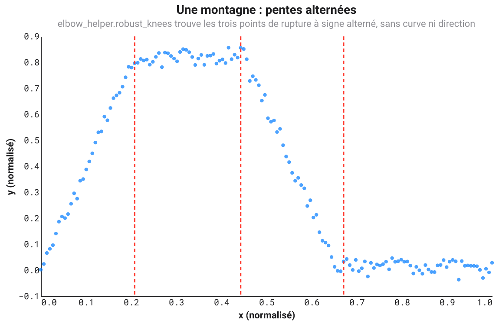
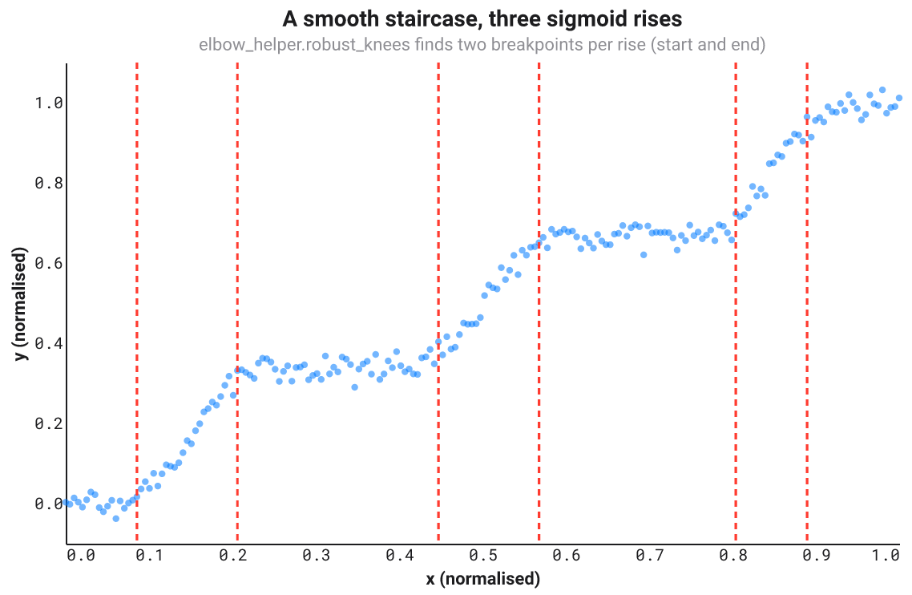
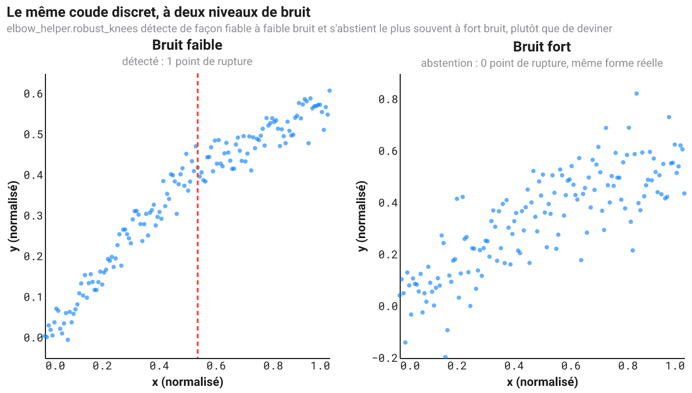
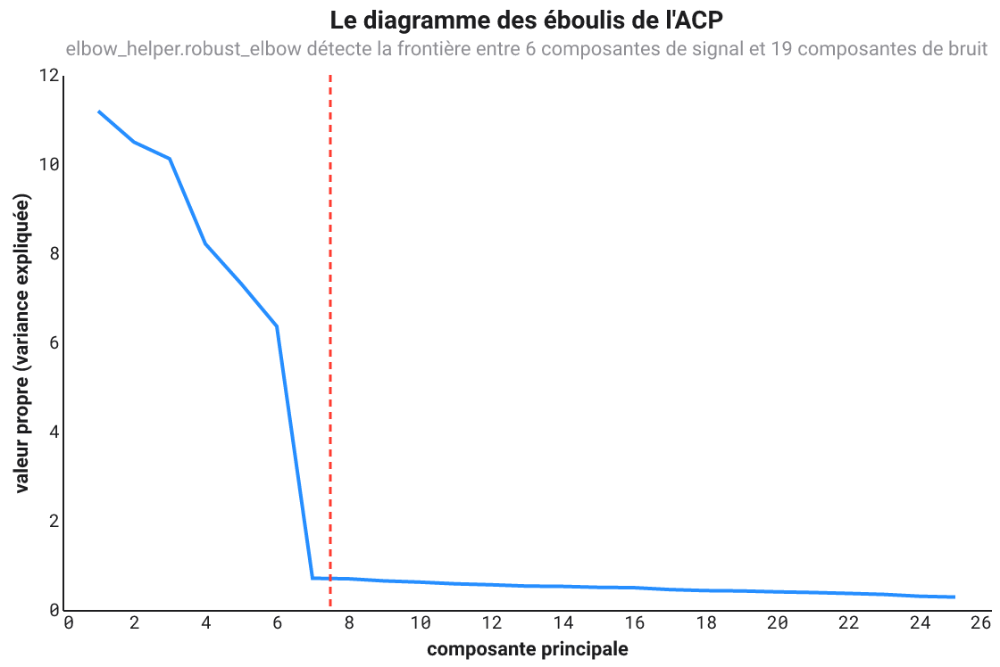

# Quelques mathématiques derrière elbow‑helper

[🇫🇷](MATH-fr.md)&nbsp;&nbsp;|&nbsp;&nbsp;[🇬🇧](MATH-en.md)

Cette note explique, à partir des principes de base, chaque brique mathématique sur laquelle repose `elbow-helper` : le pipeline à coude unique livré (`robust_knee`, `robust_elbow`) et la recherche multi-coudes qui alimente `robust_knees`. Les références se trouvent dans `references.bib`. Pour chaque affirmation, on précise s'il s'agit d'une citation vérifiée, d'une citation rapportée par une source secondaire, ou d'une construction propre à ce projet, selon la convention de sourçage adoptée dans l'ensemble du dépôt.

**Comment lire cette note.** Chaque notion reçoit le même traitement : d'abord une explication en langage ordinaire, appuyée sur un exemple concret et ne supposant rien au-delà de l'algèbre de lycée, puis la formule précise, pour qui veut vérifier chaque étape, y compris un lecteur titulaire d'un doctorat en mathématiques appliquées qui préfère contrôler la dérivation plutôt que faire confiance au texte. Les blocs de formules peuvent être sautés en première lecture si l'intuition suffit déjà à répondre à la question, quitte à y revenir plus tard.

Toute la note tourne autour d'une seule question posée trois fois, avec un réalisme croissant : que signifie géométriquement *un* coude (partie I), que signifie géométriquement *plusieurs* coudes (partie II), et comment faire confiance à l'une ou l'autre réponse une fois les données bruitées (partie III) ?

## Partie I : un coude, la géométrie d'une pliure

### 1. Mettre les données sur un pied d'égalité : la normalisation

**Intuition.** Une courbe de fréquentation d'un site web sur plusieurs mois et une courbe de cours boursiers sur plusieurs années n'ont numériquement rien de comparable : l'une peut atteindre les milliers, l'autre rester à quelques unités, et pourtant les deux pourraient partager la même *forme*. Avant de comparer des formes, on ramène les deux axes dans la même boîte, le carré unité $[0,1] \times [0,1]$, afin que chaque seuil utilisé plus loin dans le pipeline, ce qui compte pour un virage net, ce qui compte pour un bruit excessif, garde le même sens quelles que soient les unités d'origine des données.

**Formule.** $x$ est mis à l'échelle linéairement :

$$x_{\text{norm}} = \frac{x - x_{\min}}{x_{\max} - x_{\min}}$$

$y$ est mis à l'échelle de la même façon, mais en utilisant les 5e et 95e percentiles plutôt que le minimum et le maximum bruts, puis écrêté à $[0,1]$ :

$$y_{\text{scaled}} = \operatorname{clip}\!\left(\frac{y - y_{p5}}{y_{p95} - y_{p5}},\ 0,\ 1\right)$$

Ce choix de percentiles n'a rien de cosmétique : une seule valeur aberrante extrême, une erreur de saisie, un pic isolé, étirerait sinon tout l'axe $y$ pour l'accueillir et écraserait le vrai signal dans une mince bande proche de zéro. Les percentiles absorbent quelques points extrêmes sans déformer la forme qui compte (`src/elbow_helper/preprocessing.py`).

### 2. La bosse de Kneedle : ce que « coude » veut dire, précisément

**Intuition.** Un coude d'école, en forme de $\sqrt{x}$, monte vite puis se stabilise. Si l'on soustrait de la courbe elle-même la droite diagonale qui relie ses deux extrémités, le résultat est une bosse : elle part de zéro, culmine quelque part au milieu, puis revient à zéro. Le sommet de cette bosse se trouve exactement là où la courbe s'écarte le plus d'une droite, ce qui correspond à l'idée intuitive de « coude ». Kneedle, dû à Satopää, Albrecht, Irwin et Raghavan, transforme cette image en algorithme : soustraire la diagonale, repérer le sommet de la bosse, l'appeler le coude. `kneedle.py`, dans `elbow-helper`, en est un portage NumPy réécrit de zéro ; voir la section Remerciements du `README.md` du projet pour l'origine de cette implémentation.

Quatre formes existent en principe, concave croissante, concave décroissante, convexe croissante, convexe décroissante, mais une seule d'entre elles, concave croissante, correspond au cas « évident » de bosse au-dessus de la diagonale. `elbow-helper` ramène d'abord les trois autres à ce cas unique (retournement, effet miroir, ou les deux, selon `curve`/`direction`), applique la même logique de sommet de bosse, puis inverse la transformation sur le résultat obtenu. Voilà pourquoi `curve` et `direction` importent : ils indiquent à l'algorithme laquelle des quatre images miroir il a sous les yeux.

**Formule.** Une fois ramenée au repère concave croissant, la courbe de différence s'écrit

$$d(x_i) = y_{\text{norm}}(x_i) - x_{\text{norm}, i}$$

Ses maxima locaux sont les coudes candidats. À chaque maximum local $j$, un seuil de sensibilité fixe à quel point la courbe doit redescendre sous le sommet avant que celui-ci soit considéré comme un véritable coude plutôt qu'une simple oscillation :

$$T_j = d_{\max, j} - S \cdot \overline{|\Delta x_{\text{norm}}|}$$

où $S$ est le paramètre de sensibilité, plus $S$ est grand, plus l'exigence est forte, la barre désignant l'espacement moyen entre $x$ consécutifs. En parcourant la courbe de différence de gauche à droite, un coude est déclaré au dernier indice avant que $d(x)$ ne passe sous le seuil $T_j$ en vigueur ; en mode « en ligne », le parcours se réarme à chaque nouveau sommet plus élevé, si bien que seule la dernière bosse, la plus persistante, l'emporte (`src/elbow_helper/kneedle.py`, `find_knee`) [@satopaa2011].

### 3. Le modèle en ligne brisée : un coude comme changement de pente

**Intuition.** Un véritable coude devrait permettre à une droite en deux morceaux, une pente, puis une pente différente après le coude, de mieux s'ajuster aux données qu'une seule droite. `elbow-helper` construit ce modèle en deux morceaux comme une seule courbe continue, à l'aide d'une fonction charnière, $\max(0, x - k)$, qui vaut exactement zéro avant le coude $k$ et croît linéairement ensuite, de sorte que l'ajouter à une droite simple donne une unique formule pour une droite qui se plie en $k$ sans discontinuité :

$$y = a + b\,x + c \cdot \max(0,\ x - k)$$

C'est l'objet algébrique autour duquel s'articule, en définitive, chaque vérification de confiance de la partie III : l'ajuster par moindres carrés ordinaires et comparer son erreur résiduelle à celle d'une droite simple répond à la question « la pliure aide-t-elle réellement ».

### 4. Un exemple travaillé : le coude d'inertie du k-means

La docstring de `robust_elbow` désigne elle-même ce cas comme le cas convexe décroissant emblématique, et il vaut la peine de le voir tourner de bout en bout : faire tourner le k-means pour $k = 1, 2, \dots$, tracer l'inertie (la somme des carrés des distances intra-groupe) en fonction de $k$, et chercher le point au-delà duquel ajouter un groupe de plus cesse d'en valoir la peine.

`tests/test_real_world_examples.py::kmeans_inertia_curve` construit huit amas 2D bien séparés et fait tourner l'algorithme de Lloyd (quinze redémarrages aléatoires par valeur de $k$, pour éviter qu'un mauvais optimum local ne brouille la courbe) pour $k = 1, \dots, 24$. Le résultat est un coude aussi net que ce que produisent en général les données réelles : l'inertie chute d'un ordre de grandeur à $k = 8$, le vrai nombre de groupes, puis s'aplatit.

**Un piège pratique que cet exemple a révélé, et qu'il vaut la peine d'énoncer clairement.** Une courbe d'inertie du k-means n'a qu'un point par valeur de $k$ candidate, rarement plus d'une vingtaine, et son coude authentique se situe en général près du bord *gauche*, à un $k$ petit, pas au milieu. Les valeurs par défaut d'`elbow-helper` (sections 10 à 16) sont calibrées pour des courbes de mesure plus longues, plus bruitées, dont le coude peut se trouver n'importe où : `min_samples=20` et `min_side_points=5` rejettent d'emblée une courbe aussi courte et déséquilibrée vers la gauche. `tests/test_real_world_examples.py` embarque un profil de `RobustKneeConfig` avec ces deux seuils assouplis, ainsi que plusieurs des seuils de persistance et de bootstrap relâchés en conséquence, et explique dans un commentaire pourquoi exactement : les courbes appliquées courtes et propres relèvent d'un régime authentiquement différent des longues courbes bruitées de type série temporelle que ciblent les valeurs par défaut, ce n'est un défaut ni de l'un ni de l'autre.

## Partie II : plusieurs coudes, la géométrie de plusieurs pliures

### 5. Le modèle : des segments linéaires indépendants

**Intuition.** Découper la courbe en morceaux à $k$ points de rupture et ajuster à chacun sa propre droite, indépendamment, en autorisant un saut visible à chaque coupure plutôt que de forcer les morceaux à se rejoindre exactement. C'est un écart délibéré par rapport au modèle à charnière continue de la partie I : dès qu'on laisse libre plus d'un point de rupture, un ajustement linéaire par morceaux *continu* cesse de se décomposer en une somme de coûts indépendants par morceau, déplacer un point de rupture modifie la condition aux limites que chaque morceau voisin doit respecter, et cette dépendance casse les algorithmes de recherche efficaces présentés plus loin. La littérature sur les points de rupture mobilisée et testée dans cette section, Yao, Zhang et Siegmund, PELT, segmentation binaire, est énoncée pour des segments indépendants : adopter ce même modèle est ce qui rend la comparaison loyale envers *leurs* résultats, et non le test d'un modèle différent portant leur nom.

### 6. Le coût d'un segment, sous forme close

**Intuition.** Ajuster une droite à travers une poignée de points et mesurer la qualité de l'ajustement, la somme des carrés des résidus (RSS), pourrait sembler exiger de reparcourir chaque point, mais un raccourci existe : dès que cinq totaux cumulés sont connus, une somme des $x$, des $y$, des $x^2$, des $xy$, des $y^2$, le RSS de la droite la mieux ajustée pour n'importe quelle plage de points se calcule en une seule étape, sans retoucher les points un par un. Précalculer ces totaux une fois pour toutes, puis lire instantanément le coût de n'importe quel segment, rend praticable la recherche parmi des milliers de façons de découper la courbe.

**Formule.** Pour un segment couvrant $m$ points de valeurs $x_1, \dots, x_m$ et $y_1, \dots, y_m$, posons

$$S_1 = m,\quad S_x = \sum_i x_i,\quad S_y = \sum_i y_i,\quad S_{xx} = \sum_i x_i^2,\quad S_{xy} = \sum_i x_i y_i,\quad S_{yy} = \sum_i y_i^2$$

La pente et l'ordonnée à l'origine des moindres carrés pour $y = a + bx$ valent

$$b = \frac{m\,S_{xy} - S_x S_y}{m\,S_{xx} - S_x^2}, \qquad a = \frac{S_y - b\,S_x}{m}$$

et, en substituant dans $RSS = \sum_i (y_i - a - b x_i)^2$ puis en simplifiant à l'aide des équations normales,

$$RSS = S_{yy} - a\,S_y - b\,S_{xy}$$

Précalculer une fois les six sommes cumulées coûte $O(n)$ ; chaque lecture ultérieure du coût d'un segment ne coûte plus que $O(1)$. C'est une pratique courante des logiciels de détection de points de rupture, conséquence algébrique directe des équations normales des moindres carrés, qui ne nécessite pas de citation propre.

### 7. Le partitionnement optimal : la programmation dynamique

**Intuition.** Chercher la meilleure façon de placer $k$ points de rupture parmi $n$ points en essayant toutes les combinaisons possibles serait d'une lenteur astronomique. La programmation dynamique évite cela en construisant la réponse à partir de sous-réponses plus petites : la façon la moins coûteuse d'expliquer les $t$ premiers points avec $k$ segments est, pour chaque emplacement possible de la dernière coupure $s$, la façon la moins coûteuse d'expliquer les $s$ premiers points avec $k-1$ segments, additionnée du coût d'un dernier segment de $s$ à $t$, le tout minimisé sur tous les $s$ valides. Comme la meilleure réponse à $k$ segments ne dépend que des meilleures réponses à $(k-1)$ segments, déjà calculées une fois chacune, aucune combinaison n'est jamais recalculée : c'est le principe d'optimalité de Bellman.

**Formule.** Avec $C[k][t]$ le RSS total minimal des $t$ premiers points découpés en $k+1$ segments :

$$C[0][t] = \operatorname{cost}(0, t)$$

$$C[k][t] = \min_{s} \Big( C[k-1][s] + \operatorname{cost}(s, t) \Big)$$

où $s$ parcourt les coupures qui laissent chaque segment d'au moins `min_seg` points. Résoudre cela pour chaque $k$ jusqu'à $k_{\max}$ et chaque $t$ jusqu'à $n$ coûte $O(k_{\max} \cdot n^2)$, chaque cellule étant une minimisation en $O(n)$ sur des coûts de segment en $O(1)$ issus de la section 6. Des pointeurs arrière permettent de retrouver les positions de coupure effectives. `research/multiknee/tests/test_segmentation.py::test_dp_matches_brute_force_small_n` confronte ce résultat à l'énumération littérale de chaque partition valide sur de petites entrées : sa correction est donc vérifiée empiriquement, non simplement affirmée à partir de la récurrence du manuel [@cormen2022algorithms].

C'est la même récurrence qui sous-tend Yao [-@yao1988], Zhang et Siegmund [-@zhangsiegmund2007], ainsi que PELT, « Pruned Exact Linear Time », dû à Killick, Fearnhead et Eckley [-@killick2012]. PELT reprend cette récurrence en y ajoutant une étape d'élagage dont on démontre qu'elle ne supprime jamais l'optimum pour une pénalité additive : elle renvoie donc des réponses identiques, seulement plus vite. Aucune implémentation séparée de PELT n'a été construite pour cette raison, puisqu'elle reproduirait exactement ces mêmes chiffres.

### 8. La segmentation binaire gloutonne : l'alternative plus rapide, moins bonne

**Intuition.** Plutôt que de résoudre le problème dans son ensemble, faire à répétition le seul meilleur choix immédiatement disponible : trouver la coupure unique qui réduit le plus l'erreur *globale*, s'y engager, puis répéter l'opération sur les deux morceaux obtenus. C'est bien plus rapide que la programmation dynamique, mais le résultat ne peut jamais être meilleur, seulement pire ou égal, puisque les décisions prises tôt se figent avant que des preuves ultérieures existent pour les corriger.

**Un échec concret, pas hypothétique.** `research/multiknee/tests/test_segmentation.py::test_greedy_can_strictly_underperform_dp_even_when_noiseless` présente une courbe sans bruit avec deux points de rupture nets et réels, où la première coupure gloutonne ne tombe sur aucun des deux ; au moment où l'approche gloutonne ajoute une deuxième coupure, son erreur demeure strictement supérieure à l'optimum exact, à erreur nulle, de la programmation dynamique. `research/multiknee/RESULTS.md` mesure directement la conséquence en aval : toute méthode fondée sur la programmation dynamique bat son équivalent glouton. Les erreurs d'engagement précoce de l'approche gloutonne la poussent en particulier à *surestimer* le nombre de points de rupture à faible bruit, puisque corriger plus tard sa propre erreur de placement ressemble, aux yeux d'un critère de sélection de modèle, à une véritable structure supplémentaire méritant un point de rupture de plus. C'est la motivation classique de la Wild Binary Segmentation [@fryzlewicz2014].

### 9. Un exemple travaillé : une montagne aux pentes alternées

Le `robust_knee` de la partie I a besoin de `curve`/`direction` pour savoir laquelle des quatre images miroir il examine, ou doit l'inférer de la forme globale de toute la courbe. Une courbe qui monte, se stabilise, redescend, puis se stabilise à nouveau, une montagne, n'a justement aucune forme globale unique : la géométrie à signe fixe de la section 4 ne peut pas la décrire, quels que soient les réglages de `curve`/`direction`.

`robust_knees` contourne entièrement la question, puisque le modèle à segments indépendants de la section 5 ne suppose jamais un signe commun pour les pentes : chaque segment reçoit sa propre pente libre, si bien qu'un changement de signe d'un segment à l'autre n'est pas un cas particulier, seulement ce que les données montrent.

`tests/test_multiknee.py::alternating_slope_curve` construit exactement cela : montée franche, palier, descente franche, palier, quatre segments et trois points de rupture, chacun un véritable changement de signe ou d'amplitude. `robust_knees` les retrouve tous les trois, dans le bon ordre, avec les bons signes, sur chaque tirage testé.

## Partie III : un ou plusieurs coudes, avec du bruit

Les parties I et II décrivent la géométrie d'une pliure comme si les données étaient exactes. Les données réelles ne le sont jamais. Rien de ce qui précède n'est donc retenu tel quel. Cette partie est la couche de confiance : une chaîne de vérifications indépendantes qu'un candidat à coude unique doit franchir pour devenir un `ClearKnee`, et un ensemble de critères de sélection de modèle qui décident, pour le cas multi-coudes, combien de points de rupture le bruit permet réellement de soutenir.

### 10. Y a-t-il seulement une tendance ? La corrélation de rang de Spearman

**Intuition.** Avant de chercher un coude, `elbow-helper` vérifie une question plus élémentaire : `y` évolue-t-il seulement de façon cohérente avec `x` ? Pas « la relation est-elle une droite », la corrélation de Pearson pose cette question-là et se laisserait tromper par une véritable forme de coude courbée, mais « quand $x$ augmente, $y$ a-t-il tendance à monter aussi, ou à descendre, aussi sinueuse soit la courbe ». L'astuce consiste à remplacer chaque valeur par son *rang*, 1er plus petit, 2e plus petit, ainsi de suite, avant de corréler. Les rangs éliminent précisément l'information qui rendrait une corrélation ordinaire sensible à la forme exacte de la courbe ou aux valeurs aberrantes, ne conservant que la question « l'ordre est-il respecté ».

**Exemple travaillé.** Cinq points avec $x = (1,2,3,4,5)$ et $y = (2,1,5,3,9)$. Les rangs de $y$ sont $(2,1,3,4,5)$ (le rang 1 va à la plus petite valeur, donc $y=1$ en position 2 reçoit le rang 1, et ainsi de suite). Même si les valeurs brutes oscillent ($2, 1, 5, \dots$), les rangs suivent d'assez près ceux de $x$, $(1,2,3,4,5)$, ce qui donne une corrélation positive élevée malgré le creux local.

**Formule.** Avec $r_i, s_i$ les rangs de $x_i, y_i$ (les ex æquo reçoivent le rang moyen de leur groupe) :

$$\rho = \frac{\sum_i (r_i - \bar r)(s_i - \bar s)}{\sqrt{\sum_i (r_i - \bar r)^2}\ \sqrt{\sum_i (s_i - \bar s)^2}}$$

`elbow_helper.numerics.spearman` implémente cela directement, sans dépendance à `scipy.stats.rankdata`. Un coude candidat n'est retenu, à ce stade, que si $|\rho|$ franchit `config.min_spearman_abs` (0,60 par défaut) et qu'une vérification pondérée par l'amplitude, celle du « quelle part du mouvement contredit la direction annoncée », passe elle aussi ; voir `INCOMPATIBLE_GLOBAL_SHAPE` dans la liste des raisons d'abstention du README [@spearman1904].

### 11. Ne pas se fier à une seule échelle : la recherche lissage × sensibilité

**Intuition.** À sa résolution native, une courbe bruitée fait ressembler chaque petite oscillation à un coude candidat. Lissée fortement, elle peut au contraire faire disparaître un véritable coude dans le flou. Aucun des deux extrêmes n'est fiable pris isolément, si bien qu'`elbow-helper` fait tourner Kneedle sur toute une grille : plusieurs largeurs de lissage gaussien, de $1$, aucun lissage, jusqu'à environ un quart des données, croisées avec plusieurs sensibilités $S$. Chaque exécution qui trouve un coude verse un candidat dans un réservoir commun ; rien n'est encore retenu à ce stade, on ne fait que *proposer*.

### 12. Ne le compter que s'il survit partout : le regroupement par persistance

**Intuition.** Un coude authentique devrait apparaître à presque toutes les largeurs de lissage et toutes les sensibilités, en ne se déplaçant que légèrement. Un coude qui n'est en réalité que du bruit a tendance à sauter de façon imprévisible quand le lissage change, ou à n'apparaître qu'à un ou deux réglages avant de disparaître ailleurs. `elbow-helper` regroupe l'ensemble des candidats par emplacement, à `cluster_tolerance` près, en unités $x$ normalisées, puis pose au plus grand groupe les questions suivantes : s'étend-il sur plusieurs échelles de lissage *consécutives*, apparaît-il à la plupart des sensibilités, sa dispersion (écart absolu médian) est-elle resserrée ? Si deux groupes sont à la fois grands et comparablement soutenus, le pipeline refuse explicitement de désigner un gagnant (`MULTIPLE_PLAUSIBLE_KNEES`) plutôt que de deviner (`src/elbow_helper/clustering.py`).

### 13. Confirmer la pente : le contraste de Theil-Sen

**Intuition.** La façon ordinaire d'estimer une pente, ajuster une droite à un ensemble de points, se laisse facilement perturber par un seul point aberrant éloigné des autres. L'estimateur de Theil-Sen contourne le problème : calculer la pente entre *chaque paire* de points, puis prendre la médiane de toutes ces pentes. Une poignée de paires abîmées, impliquant une valeur aberrante, se retrouvent minoritaires face à la majorité des bonnes paires.

**Exemple travaillé.** Trois points $(0,0), (1,1), (2,100)$, le dernier étant une valeur aberrante extrême. Pentes par paires : $(1-0)/(1-0)=1$, $(100-0)/(2-0)=50$, $(100-1)/(2-1)=99$. La médiane de $\{1, 50, 99\}$ vaut $50$, encore tirée par la valeur aberrante avec seulement trois points, mais avec davantage de points normaux et une seule valeur aberrante, la médiane cesse de bouger dès que les valeurs aberrantes deviennent minoritaires, contrairement à un ajustement par moindres carrés ordinaire, que la valeur aberrante dominerait immédiatement.

**Formule.**

$$\hat\beta = \operatorname{median}_{i < j} \frac{y_j - y_i}{x_j - x_i}$$

`elbow-helper` calcule cela sur une petite fenêtre juste avant puis juste après le coude candidat, puis compare les deux pentes :

$$\text{contrast} = \frac{|m_{\text{left}} - m_{\text{right}}|}{|m_{\text{left}}| + |m_{\text{right}}| + \epsilon}$$

Un contraste inférieur à `config.min_slope_contrast` (0,30 par défaut) fait échouer cette vérification (`WEAK_SLOPE_CHANGE`) [@theil1950] [@sen1968].

### 14. Confirmer le modèle : le BIC et la validation croisée par blocs

**Intuition.** Tout paramètre libre supplémentaire dans un modèle ne peut que l'aider à mieux s'ajuster aux données *d'entraînement*, de façon purement mécanique, qu'il capture ou non quelque chose de réel : un modèle avec autant de paramètres que de points de données s'ajuste parfaitement et n'explique rien. Le critère d'information bayésien, correction apportée par Schwarz à ce problème, facture à chaque paramètre supplémentaire un péage fixe, en unités d'amélioration de vraisemblance logarithmique nécessaire pour que cela en vaille la peine, de sorte qu'un modèle n'est préféré que s'il franchit cette barre.

**Formule.** Pour un ajustement gaussien par moindres carrés ordinaires avec $n$ points, $p$ paramètres libres (y compris la variance du bruit elle-même) et $RSS$ la somme des carrés des résidus :

$$\mathrm{BIC} = n \ln\!\left(\frac{RSS}{n}\right) + p \ln n$$

Plus c'est bas, mieux c'est. `elbow_helper.numerics.bic` implémente exactement cela ; le pipeline à coude unique compare le $\mathrm{BIC}$ de la droite simple ($p = 2 + 1$) à celui de la ligne brisée ($p = 3 + 1$) de la section 3, en exigeant une amélioration d'au moins `config.min_bic_improvement` (10 par défaut) [@schwarz1978] [@hastie2009esl] [@bishop2006prml].

Le BIC vérifie seulement si le paramètre supplémentaire vaut sa pénalité *sur les données ayant servi à l'ajuster*. La validation croisée par blocs pose une question complémentaire, plus méfiante : la ligne brisée l'emporte-t-elle encore une fois testée sur des données qu'elle n'a jamais vues pendant l'ajustement ? Une validation croisée ordinaire, mélangée, laisserait fuir de l'information ici, puisque des points voisins sur une courbe se ressemblent ; `elbow-helper` met donc de côté, tour à tour, des blocs *contigus* de $x$, et non des points tirés au hasard, ce qui imite l'allure qu'aurait la courbe si un segment vraiment inédit venait à manquer. C'est la même exigence de rigueur que défend longuement le livre de Marcos López de Prado sur le machine learning financier, dans le contexte de données ordonnées et séquentielles [-@lopezdeprado2018financial].

### 15. Le bootstrap : le coude survit-il à une reprise ?

**Intuition.** Si la collecte des données était refaite, le même coude réapparaîtrait-il, ou le coude observé n'était-il qu'un coup de chance lié au bruit particulier de cette exécution ? Comme une véritable reprise n'est pas disponible, le bootstrap en simule une : prendre les résidus laissés par l'ajustement du modèle en ligne brisée accepté, la part de $y$ que le modèle n'a pas expliquée, les rééchantillonner avec remise, les rajouter au modèle ajusté pour construire une courbe de « reprise » synthétique, puis relancer la recherche *entière* sur celle-ci. Répéter l'opération de nombreuses fois, le bootstrap d'Efron. Un coude qui n'apparaît que dans l'exécution d'origine, et rarement dans les reprises rééchantillonnées, était probablement un coup de chance.

**Formule.** Pour chacune des $B$ répétitions, $y^\ast = \hat y + r^\ast$ où $r^\ast$ est un rééchantillonnage avec remise des résidus observés. `elbow-helper` exige que le coude soit redétecté dans au moins `config.min_bootstrap_detection_rate` (90 % par défaut) des répétitions, avec un intervalle à 90 % resserré et unimodal, l'écart entre les 5e et 95e percentiles des emplacements redétectés [@efron1979] [@hastie2009esl].

### 16. Le test nul : une droite pourrait-elle expliquer cela par hasard ?

**Intuition.** La dernière vérification, la plus méfiante : simuler de nombreuses courbes qui n'ont *aucun* véritable coude, des droites portant un bruit à la même échelle estimée que les résidus du modèle accepté, exécuter exactement la même procédure de recherche et de confirmation sur chacune, et compter à quelle fréquence cette procédure parvient tout de même à rapporter un coude aussi fort que celui réellement observé. Si le pur bruit produit régulièrement quelque chose d'aussi fort, le coude observé n'est pas une preuve fiable d'une véritable pliure : c'est simplement à quoi ressemblent, parfois, des droites bruitées.

**Formule.** Avec $B = $ `config.null_replicates` (200 par défaut) répétitions de Monte-Carlo et une statistique de test ajustée à la recherche, lexicographique, de sorte qu'une répétition nulle ne « batte » le coude observé que si elle franchit *les mêmes* barrières de confirmation, et pas seulement un score brut :

$$p = \frac{1 + \#\{\text{répétitions nulles au moins aussi fortes que l'observation}\}}{B + 1}$$

Le $+1$ au numérateur et au dénominateur est la correction usuelle à taille finie qui empêche une valeur $p$ de Monte-Carlo d'annoncer un jour un zéro exact. `elbow-helper` exige $p \le$ `config.max_null_p_value` (0,01 par défaut) (`src/elbow_helper/null_test.py`, dont la docstring du module énonce cette formule exacte).

Seul un candidat qui franchit chacune des vérifications des sections 8 à 14 devient un `ClearKnee`.

### 17. Le BIC nu pour plusieurs coudes : le critère naïf et pourquoi il surestime

**Intuition.** Le BIC de la section 14 pénalise le nombre de paramètres de *régression* libres, mais choisir *où* placer $k$ points de rupture parmi environ $n$ positions possibles est lui-même une forme de liberté, que le BIC nu ne facture jamais. C'est comme si un examen à choix multiples ne retirait des points que pour les mauvaises réponses aux questions tentées, en ignorant combien de questions il y avait à choisir au départ.

**Formule.** Avec $p = 2(k+1) + 1$, deux paramètres de régression par segment indépendant, plus la variance du bruit :

$$\mathrm{BIC}(k) = n \ln\!\left(\frac{RSS(k)}{n}\right) + p \ln n$$

La conséquence n'est pas que théorique : `RESULTS.md` mesure un taux de faux positifs de 27 % pour ce critère exact sur des données sans point de rupture réel, et seulement 0,65 de précision globale exacte en $k$, le pire des quatre critères testés sur les segmentations issues de la programmation dynamique [@yao1988] [@zhangsiegmund2007].

La raison plus profonde de cette sous-facturation : l'emplacement d'un point de rupture n'est pas un paramètre « régulier » au sens technique que suppose la dérivation du BIC. La log-vraisemblance n'est pas lisse, deux fois différentiable, en l'emplacement, si bien que l'estimateur de l'emplacement ne converge pas au taux habituel $\sqrt n$ avec une limite gaussienne : il converge plus vite, au taux $n$, avec une distribution limite donnée par l'argmax d'une marche aléatoire. Facturer $\frac{1}{2}\ln n$ par paramètre, l'argument d'approximation de Laplace derrière le BIC, suppose exactement la régularité qui s'effondre ici.

### 18. Le BIC modifié : la correction de Zhang et Siegmund et une convention de signe résolue par le test

**Intuition.** Si le BIC nu sous-facture la liberté de placer des points de rupture, la correction consiste à facturer davantage, en particulier *davantage pour des segments très courts ou très inégaux*, puisqu'un segment minuscule offre bien plus de liberté de placement, de nombreuses positions voisines paraissant presque aussi bonnes, qu'un segment couvrant une large portion bien définie des données.

**Formule.** La pénalité de Zhang et Siegmund, rapportée ici via une source secondaire plutôt que l'article original, s'écrit

$$\text{penalty}(k) = 3k \ln n + \sum_{j=1}^{k+1} \ln\!\left(\frac{\ell_j}{n}\right)$$

où $\ell_j$ sont les longueurs de segments obtenues. Le $3$, au lieu du $2$ implicite du BIC nu issu des deux seuls paramètres de régression, constitue déjà à lui seul une charge de complexité plus forte ; le second terme est toujours $\le 0$ et, par la concavité du logarithme, se rapproche de zéro quand les segments sont équilibrés, et s'en éloigne le plus quand ils sont très inégaux.

**Une ambiguïté réelle, résolue empiriquement plutôt que supposée.** En intégrant cette pénalité par addition directe dans un critère où plus c'est bas, mieux c'est,

$$\mathrm{mBIC}_{\text{additive}}(k) = n \ln\!\left(\frac{RSS(k)}{n}\right) + 3k \ln n + \sum_{j=1}^{k+1} \ln\!\left(\frac{\ell_j}{n}\right)$$

le cas le plus négatif, celui des segments inégaux, abaisse le total : cette combinaison *récompense* les segments inégaux, l'inverse du comportement attendu, « pénaliser les segments courts et inégaux ». En soustrayant plutôt le même terme,

$$\mathrm{mBIC}_{\text{subtractive}}(k) = n \ln\!\left(\frac{RSS(k)}{n}\right) + 3k \ln n - \sum_{j=1}^{k+1} \ln\!\left(\frac{\ell_j}{n}\right)$$

on pénalise bien les segments inégaux, conformément à l'intention affichée par la littérature. Les deux formes sont implémentées et comparées directement : `modified_bic_subtractive` atteint une précision globale de 0,85 et un taux de faux positifs de 0 % à $\text{true } k = 0$ ; `modified_bic_additive` bat encore le BIC nu (0,77 contre 0,65) mais laisse un taux de faux positifs de 11 %. **C'est la forme soustractive qui est livrée.**

### 19. L'ICL : des modèles de mélange aux points de rupture, avec un bogue trouvé et corrigé au passage

**Intuition.** L'Integrated Completed Likelihood de Biernacki, Celeux et Govaert, conçue pour choisir le nombre de groupes dans un modèle de mélange, ajoute une considération supplémentaire au-dessus du BIC : non seulement « ce modèle s'ajuste-t-il bien compte tenu de sa complexité », mais aussi « les groupes obtenus sont-ils réellement non ambigus ». Deux groupes qui se chevauchent, difficiles à distinguer, sont pénalisés même s'ils s'ajustent aux données à peu près aussi bien que deux groupes nets et bien séparés. Gilles Celeux, coauteur de l'article original sur l'ICL, a plus tard coécrit un ouvrage entier consacré à cette même famille de méthodes [@bouveyron2021mbc].

Pour les points de rupture, l'équivalent de « à quel groupe appartient ce point » devient « où se situe exactement la coupure » : l'incertitude pertinente porte sur la *segmentation discrète entière*, non sur des étiquettes individuelles associant chaque point à un groupe. Rigaill, Lebarbier et Robin fournissent la machinerie nécessaire : une distribution a posteriori exacte, non asymptotique, sur chaque façon de placer $K-1$ points de rupture, via un programme dynamique avant-arrière structurellement identique à l'algorithme avant-arrière d'un modèle de Markov caché, exécuté sur des segmentations plutôt que sur des états cachés [-@rigaill2012] ; Cleynen, Luong, Rigaill et Nuel s'appuient directement sur ce résultat [-@cleynen2013].

**Formule.** Une passe avant calcule, en espace logarithmique, la masse de vraisemblance totale sur chaque partition valide à $K$ segments des $t$ premiers points, à l'aide de la log-vraisemblance gaussienne du segment

$$\ell\ell(i, j) = -\frac{RSS(i, j)}{2\sigma^2} - \frac{j - i}{2} \ln(2\pi\sigma^2)$$

$$\log Z_1(t) = \ell\ell(0, t), \qquad \log Z_K(t) = \log \sum_{s} \exp\!\Big( \log Z_{K-1}(s) + \ell\ell(s, t) \Big)$$

L'entropie de la distribution a posteriori discrète résultante sur les segmentations, $H(K) = \log Z_K(n) - \mathbb{E}[\ell\ell(S)]$, s'estime par échantillonnage arrière de Monte-Carlo, en tirant des segmentations complètes selon la distribution a posteriori puis en moyennant leurs log-probabilités, plutôt que par une forme close.

**Un bogue que les tests ont attrapé, et non un choix de conception.** La première version construite ici définissait le score directement comme $-\log Z_K(n) + H(K)$, pure vraisemblance intégrée additionnée d'entropie, sans pénalité de complexité séparée, en supposant que la distribution a posteriori exacte « contenait » déjà toute la notion de complexité nécessaire. Un test sur soixante points de pur bruit a infirmé cette hypothèse : $\log Z_K(n)$ est passé de 89,8 ($K=1$) à 94,7, 99,0, puis 102,8 nats à mesure que $K$ montait jusqu'à 4, du simple fait de sommer sur un nombre combinatoirement croissant de segmentations candidates, tandis que l'entropie ne montait que de 0 à 3,7, 5,9, puis 7,9 nats sur les mêmes étapes, trop lentement pour compenser cette croissance. Le score obtenu continuait donc de s'améliorer à mesure que $K$ augmentait, même sur du pur bruit, exactement l'échec par surestimation que cet exercice tout entier vise à éviter.

La correction découle d'une relecture de la forme du modèle de mélange ci-dessus : l'ICL est *le BIC augmenté* d'une correction d'entropie, et non un remplacement de la propre pénalité de complexité du BIC :

$$\mathrm{ICL}(k) = \mathrm{BIC}(k) + 2\,H(K), \qquad K = k+1$$

Retestée sur les mêmes données de bruit pur, cette version sélectionne correctement $k = 0$ ; `RESULTS.md` montre qu'une fois corrigée, elle se situe dans la même tranche de performance que le mBIC soustractif (0,82 contre 0,85 de précision globale) [@biernacki2000].

### 20. Un test séquentiel à taux d'erreur familial contrôlé

**Intuition.** Indépendamment de tout score de la famille du BIC, une question plus directe peut être posée à chaque étape : en parcourant la séquence de segmentations $k = 1, 2, \dots$, la réduction d'erreur due à l'ajout du point de rupture $k$ dépasse-t-elle ce que produirait le pur hasard ? On y répond comme un test de permutation répond à toute question de ce genre : rééchantillonner de nombreuses fois à quoi ressemble le « hasard », puis regarder à quelle fréquence le hasard seul dépasse ce qui a réellement été observé.

**Formule.** À chaque étape, les résidus $r = y - \hat y_{k-1}$ du modèle à $(k-1)$ points de rupture accepté sont rééchantillonnés avec remise, encore le bootstrap d'Efron, pour construire $B$ courbes synthétiques $y^\ast = \hat y_{k-1} + r^\ast$. Sur chacune, on calcule la plus grande réduction d'erreur qu'apporterait une coupure de plus, n'importe où, ce qui donne une distribution nulle :

$$p = \frac{1 + \#\{\text{répétitions dont la réduction nulle} \ge \text{réduction observée}\}}{B + 1}$$

Le point de rupture $k$ n'est accepté que si $p \le \alpha / k_{\max}$, une correction de Bonferroni appliquée sur jusqu'à $k_{\max}$ tests séquentiels. La procédure s'arrête au premier point de rupture qui échoue, si bien qu'elle ne peut jamais « sauter » un point de rupture rejeté pour en accepter un plus tard. Bonferroni est une correction conservatrice pour des tests indépendants ; ces tests séquentiels ne le sont pas, chacun étant conditionné au modèle accepté à l'étape précédente, ce qui maintient le taux d'erreur familial réel, la probabilité d'accepter au moins un point de rupture parasite n'importe où dans la séquence, au plus égal au $\alpha$ nominal, jamais supérieur.

`RESULTS.md` montre que cette approche atteint un taux de faux positifs de 0 % à $\text{true } k = 0$ et une précision globale de 0,82, dans la même tranche que le mBIC soustractif et l'ICL corrigé. Deux alternatives plus rigoureuses ont été envisagées puis écartées : le test asymptotique de Davies [-@davies1977] et la garantie multiéchelle de SMUCE, « Simultaneous MUlti-scale Change-point Estimator » [@frick2014], au profit d'un test de permutation dont la correction se vérifie directement par simulation.

### 21. Ce que cela laisse à l'API livrée

`elbow_helper.robust_knees` livre exactement la combinaison validée ci-dessus : recherche par programmation dynamique (section 7), le BIC modifié à signe soustractif comme critère principal (section 18), et la barrière séquentielle à taux d'erreur familial contrôlé (section 20) superposée par défaut, en retenant $\min(k \text{ du mBIC},\ k \text{ du FWER})$. Ce choix suit la priorité de conception assumée par `elbow-helper` : minimiser les coudes faussement positifs, même au prix de davantage d'abstentions. Le BIC nu, le mBIC additif, l'ICL et la recherche gloutonne restent dans `research/multiknee/` comme alternatives testées puis écartées, ou testées puis jugées trop coûteuses, qui justifient ce choix, sans être livrées comme options de configuration publiques : la surface de l'API publique reflète ainsi ce qui a réellement fait ses preuves.

### 22. Un exemple travaillé : un escalier de sigmoïdes

Chaque section ci-dessus est soit une formule, soit une affirmation vérifiée par un test. Voici une courbe, passée dans le code réellement livré, pour voir où toute la chaîne aboutit concrètement.

Une sigmoïde logistique, $1/(1+e^{-\text{steepness}(x-\text{center})})$, monte doucement de 0 à 1 autour de son centre et n'a littéralement aucun point de rupture nulle part : elle est indéfiniment différentiable, sans la moindre cassure à laquelle une recherche linéaire par morceaux pourrait s'accrocher en principe. Sommer trois sigmoïdes à des centres différents, chacune mise à l'échelle pour ajouter une « marche », construit un escalier lisse : trois montées séparées par des paliers plats, la forme qui apparaît chaque fois que plusieurs seuils indépendants sont franchis en séquence, trois cohortes distinctes d'utilisatrices et utilisateurs, chacune montant en puissance d'adoption une semaine différente, ou trois capteurs distincts saturant chacun à une charge différente.

Un modèle linéaire par morceaux, appliqué à une courbe lisse comme celle-ci, ne peut représenter une montée avec un seul segment droit sans tronquer soit un palier plat, soit la montée elle-même. Le compromis auquel s'arrête `robust_knees` est visible directement sur la figure ci-dessous : chacune des trois montées se retrouve encadrée par *deux* points de rupture, l'un où le palier plat se termine et où la montée commence, l'autre où la montée se termine et où le palier suivant commence. Trois montées, six points de rupture, sans exception sur cinq tirages de bruit différents testés (`tests/test_multiknee.py::test_sigmoid_staircase_brackets_each_rise_with_a_breakpoint_pair`).

Un piège pratique que cet exemple a révélé, et qu'il vaut la peine d'énoncer clairement : la correction de Bonferroni de la barrière à taux d'erreur familial contrôlé divise $\alpha$ par $k_{\max}$, si bien que la plus petite valeur $p$ que le test de permutation puisse produire, $1/(n_{\text{permutations}}+1)$, doit rester sous $\alpha/k_{\max}$, sans quoi la barrière ne peut jamais passer, aussi réel soit l'effet. Avec le $k_{\max}=4$ par défaut et $\text{fwer\_permutations}=200$, $1/201 \approx 0,005 < 0,05/4 = 0,0125$, largement en dessous. Augmenter $k_{\max}$, comme l'exige cet exemple à six points de rupture, sans relever aussi `fwer_permutations` verrouille silencieusement la barrière : c'est exactement ce qui s'est produit lors de la première tentative de cet exemple ($k_{\max}=8$, les 100 permutations par défaut, chaque point de rupture rejeté, $k=0$), repéré en examinant les diagnostics plutôt qu'en supposant que l'algorithme avait échoué pour une raison plus mystérieuse.

### 23. Un exemple travaillé : le même coude discret, à deux niveaux de bruit

Chaque vérification des sections 10 à 16 existe pour répondre honnêtement à une seule question : ce coude est-il réel, ou est-ce simplement à quoi ressemble le bruit, parfois ? La façon la plus nette de voir la réponse est de garder la forme réelle fixe et de ne faire varier que le bruit.

`tests/test_multiknee.py::subtle_knee_curve` est délibérément peu spectaculaire : un petit changement de pente bien réel en $x = 0,5$, loin de la netteté de l'escalier de sigmoïdes ou de la montagne. À faible bruit, `robust_knees` le détecte de façon fiable, sur chaque tirage testé. À fort bruit, avec exactement la même forme réelle en dessous, il s'abstient le plus souvent, rapportant zéro point de rupture plutôt que de deviner.

C'est la priorité de conception de la section 21 rendue visible sur une seule courbe : `elbow-helper` est construit pour se tromper dans le sens honnête. Manquer un coude réel à fort bruit est un coût que cette bibliothèque accepte délibérément ; rapporter un coude qui n'est en réalité que du bruit est précisément l'échec que chaque vérification de la partie III existe pour écarter.

### 24. Un exemple travaillé : le diagramme des éboulis de l'ACP

L'autre cas que la docstring de `robust_elbow` désigne directement : un diagramme des éboulis, les valeurs propres d'une matrice de covariance en ordre décroissant, utilisé pour décider combien de composantes principales portent un vrai signal plutôt que du bruit.

`tests/test_real_world_examples.py::pca_scree_curve` construit des données avec six véritables dimensions de signal (grande variance) noyées dans dix-neuf dimensions de bruit (variance faible, à peu près égale), tournées de sorte que le signal ne soit aligné sur aucun axe mesuré directement, exactement la situation que l'ACP est conçue pour démêler. La courbe de valeurs propres obtenue chute d'un ordre de grandeur juste à la frontière signal/bruit, puis s'aplatit dans la longue traîne à décroissance lente que produisent de vraies valeurs propres de bruit.

Cet exemple partage exactement le piège pratique de la section 4 : un diagramme des éboulis est court et déséquilibré vers la gauche de la même façon qu'une courbe d'inertie, et a donc besoin du même profil assoupli de `RobustKneeConfig`. Il révèle aussi une convention qu'il vaut la peine de connaître avant de lire `knee_x` sur n'importe quelle courbe appliquée courte : la règle de Kneedle, « le dernier point avant la pliure », place systématiquement le coude une à deux composantes *après* la dernière véritable composante de signal, pas exactement dessus. Sur chaque tirage testé, le coude détecté tombe à 6 ou 7 composantes pour une dimension de signal réelle de 6, jamais en dessous, un décalage systématique et prévisible plutôt qu'un effet du bruit.

## Pour aller plus loin

Pour un traitement plus approfondi ou plus rigoureux des idées ci-dessus que cette note n'en a l'ambition, non comme sources d'une affirmation précise déjà citée, mais comme pistes pour aller plus loin :

- Hastie, Tibshirani et Friedman sur les compromis biais-variance derrière le BIC, la validation croisée et le bootstrap [-@hastie2009esl]
- Bishop sur le cadre bayésien de sélection de modèle qui motive le BIC et l'ICL [-@bishop2006prml]
- Bouveyron, Celeux, Murphy et Raftery sur les modèles de mélange et le clustering à base de modèles, à l'échelle d'un ouvrage entier [-@bouveyron2021mbc]
- Cormen, Leiserson, Rivest et Stein sur la programmation dynamique en général [-@cormen2022algorithms]
- López de Prado sur la rigueur de validation pour des données ordonnées et séquentielles [-@lopezdeprado2018financial]
