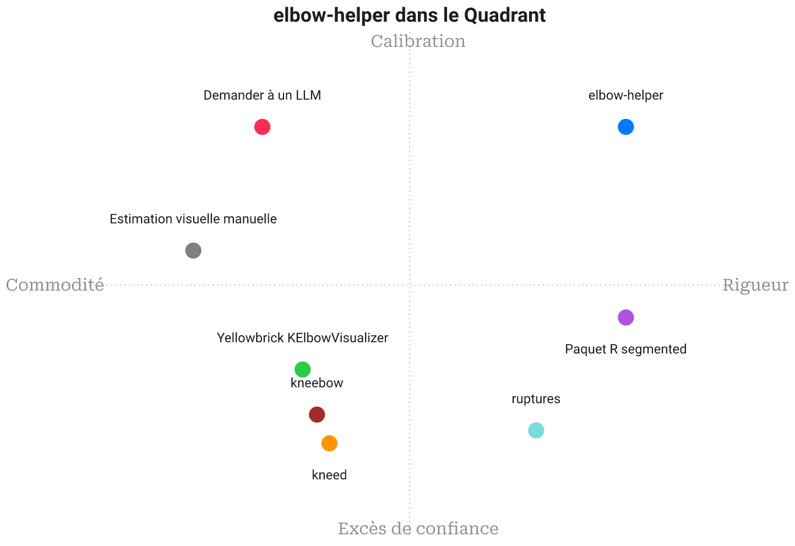

# Paysage

[🇫🇷](PAYSAGE.md)&nbsp;&nbsp;|&nbsp;&nbsp;[🇬🇧](LANDSCAPE.md)

Comment `elbow-helper` se compare à *toutes les autres façons de trouver un coude*. Chaque approche est notée sur **le travail de ce projet, rapporter un coude seulement quand les preuves le soutiennent, et le dire explicitement sinon**, sans être pénalisée pour exceller à un autre travail (détection brute de points de rupture, visualisation exploratoire, inférence statistique en R).

## Positionnement

`elbow-helper` ne concurrence pas `ruptures` sur la recherche multi-points de rupture, ni le jugement d'un statisticien sur un jeu de données déjà bien compris. Il répond à une question plus étroite et plus difficile : étant donné une seule courbe et aucun autre contexte, un coude candidat est-il assez solide pour qu'on lui fasse confiance ? La plupart des outils du domaine renvoient toujours une estimation ponctuelle (`kneed`, `kneebow`, le `KElbowVisualizer` de Yellowbrick), ou demandent à un humain de fournir le jugement qu'`elbow-helper` automatise (estimation visuelle, invite adressée à un LLM). Son analogue le plus proche n'est pas un autre localisateur de coude mais le paquet `segmented` de R, qui partage le même réflexe : une affirmation de coude devrait s'accompagner d'une erreur type, pas seulement d'une coordonnée.

## En un coup d'œil

| Outil de détection de coude | Robustesse au bruit | Inférence automatique de la forme | Abstention explicite | Points de rupture multiples | Test de significativité statistique | Quantification de l'incertitude | Rigueur de sélection de modèle | Empreinte de dépendances | Facilité d'utilisation en un appel | Reproductibilité | Mathématiques publiées |
| --- | --- | --- | --- | --- | --- | --- | --- | --- | --- | --- | --- |
| **elbow-helper** | ⭐⭐⭐⭐⭐ | ⭐⭐⭐⭐⭐ | ⭐⭐⭐⭐⭐ | ⭐⭐⭐⭐⭐ | ⭐⭐⭐⭐⭐ | ⭐⭐⭐⭐⭐ | ⭐⭐⭐⭐⭐ | ⭐⭐⭐⭐⭐ | ⭐⭐⭐⭐ | ⭐⭐⭐⭐⭐ | ⭐⭐⭐⭐⭐ |
| **kneed** | ⭐⭐ | ⭐⭐ | ⭐ | ⭐⭐ | ⭐ | ⭐ | ⭐ | ⭐⭐⭐⭐ | ⭐⭐⭐⭐⭐ | ⭐⭐⭐⭐⭐ | ⭐⭐⭐ |
| **ruptures** | ⭐⭐⭐ | ⭐ | ⭐⭐ | ⭐⭐⭐⭐⭐ | ⭐⭐ | ⭐ | ⭐⭐⭐ | ⭐⭐⭐ | ⭐⭐⭐ | ⭐⭐⭐⭐⭐ | ⭐⭐⭐⭐ |
| **kneebow** | ⭐⭐ | ⭐⭐⭐ | ⭐ | ⭐ | ⭐ | ⭐ | ⭐ | ⭐⭐⭐⭐⭐ | ⭐⭐⭐⭐ | ⭐⭐⭐⭐⭐ | ⭐⭐ |
| **KElbowVisualizer** | ⭐⭐ | ⭐⭐⭐ | ⭐⭐ | ⭐ | ⭐ | ⭐ | ⭐ | ⭐ | ⭐⭐⭐⭐⭐ | ⭐⭐⭐⭐ | ⭐⭐⭐ |
| **Paquet R segmented** | ⭐⭐⭐ | ⭐⭐ | ⭐⭐ | ⭐⭐⭐⭐ | ⭐⭐⭐⭐ | ⭐⭐⭐⭐ | ⭐⭐⭐ | ⭐⭐ | ⭐⭐ | ⭐⭐⭐⭐ | ⭐⭐⭐⭐⭐ |
| **Estimation visuelle manuelle** | ⭐ | ⭐ | ⭐⭐⭐ | ⭐⭐ | ⭐ | ⭐ | ⭐ | ⭐⭐⭐⭐⭐ | ⭐⭐⭐⭐⭐ | ⭐ | ⭐ |
| **Demander à un LLM** | ⭐⭐ | ⭐⭐⭐⭐ | ⭐⭐⭐ | ⭐⭐⭐ | ⭐ | ⭐⭐ | ⭐ | ⭐⭐ | ⭐⭐⭐⭐⭐ | ⭐⭐ | ⭐ |

## Fiche par outil

### kneed
L'implémentation de référence de l'algorithme Kneedle dont le propre localisateur d'`elbow-helper` est un portage, crédité dans la section Remerciements du README. Excellent dans son unique tâche : étant donné une courbe et un couple `curve`/`direction` explicite, il renvoie un point unique, de façon déterministe, en une ligne de code. Il ne porte aucune notion de confiance et n'offre aucun chemin vers « il n'y a pas de coude ici » au-delà d'un `None` peu explicite. `elbow-helper` enveloppe cette même idée géométrique dans la machinerie de confirmation que kneed laisse entièrement à la charge de l'appelant.

### ruptures
Le bon outil quand la question posée est réellement « combien de points de rupture, et où » sur un signal, avec PELT, la segmentation binaire et la recherche par fenêtre déjà intégrés. Il est indifférent à ce que « coude » veut même dire : une courbe à rendements décroissants et un changement de moyenne dans du bruit sont, pour lui, le même genre d'objet. La propre recherche multi-coudes d'`elbow-helper` (`research/multiknee/`) teste ce même programme dynamique proche de PELT qu'utilise `ruptures`, en y ajoutant la couche de sélection de modèle (mBIC, FWER) que `ruptures` laisse à l'utilisateur le soin de configurer.

### kneebow
Un petit paquet léger en dépendances, construit autour de la même idée de rotation que Kneedle, géométrique et rapide. Comme kneed, il s'engage sur une réponse à chaque appel, sans recherche sur une échelle de lissage, sans bootstrap, et sans test d'hypothèse nulle derrière le nombre qu'il renvoie.

### Yellowbrick KElbowVisualizer
La façon la plus répandue, en pratique, de trouver le coude du k-means : ajuster pour plusieurs valeurs de k, tracer la courbe d'inertie, puis estimer à l'œil ou laisser un repérage automatique faire le travail. C'est un outil de visualisation déguisé en localisateur, construit pour une seule forme de courbe (convexe, décroissante) plutôt que pour le problème général du coude. Il hérite en outre de scikit-learn et de matplotlib comme dépendances obligatoires. Le propre exemple k-means d'`elbow-helper` (`MATH-fr.tex`, partie I) vise exactement cette courbe, avec la chaîne de confirmation que la lecture visuelle de Yellowbrick ne fait jamais tourner.

### Paquet R segmented
L'alternative de loin la plus rigoureuse statistiquement : une véritable régression en ligne brisée, avec erreurs types, test de Davies et prise en charge de points de rupture multiples (`psi`), dans un paquet R mature et validé par les pairs. Ce qu'il exige de l'utilisateur est une réelle aisance statistique : une formule de modèle, des valeurs de départ pour les points de rupture, et R lui-même plutôt qu'un simple appel Python en une ligne. `elbow-helper` automatise les parties de ce flux de travail, recherche sur l'échelle de lissage, bootstrap, test nul, que `segmented` laisse au jugement d'un analyste humain.

### Estimation visuelle manuelle
La référence universelle : regarder le tracé, décider où il plie. Un analyste attentif peut honnêtement dire « je ne vois pas de coude net ici », ce qui est déjà plus que ce que la plupart des outils automatisés savent faire, mais le jugement ne se reproduit pas d'une personne à l'autre, ni même d'un jour à l'autre chez la même personne. Il ne passe pas non plus à l'échelle au-delà d'une poignée de courbes.

### Demander à un LLM
Une variante moderne de l'estimation visuelle : coller les données ou une capture d'écran dans un modèle conversationnel et demander où se situe le coude. Les grands modèles de langage décrivent une forme en mots avec aisance et peuvent nuancer leur réponse si on le leur demande, mais la réponse n'est pas déterministe d'une exécution à l'autre, ne porte aucune incertitude calibrée, et ne repose sur aucune dérivation reproductible qu'un lecteur pourrait vérifier.

## La thèse

Chaque alternative ici excelle à quelque chose qu'`elbow-helper` ne cherche pas à être : `ruptures` pour compter les points de rupture, `segmented` pour l'inférence statistique complète, Yellowbrick pour une lecture visuelle rapide, un LLM pour décrire une forme en mots simples. Ce qu'aucune d'elles ne fait par défaut, c'est refuser de répondre. `elbow-helper` existe pour le cas plus étroit où une mauvaise réponse coûte plus cher qu'une absence de réponse, et traite « il n'y a pas de coude net ici » comme un résultat à part entière, aussi bien étayé que les autres.
