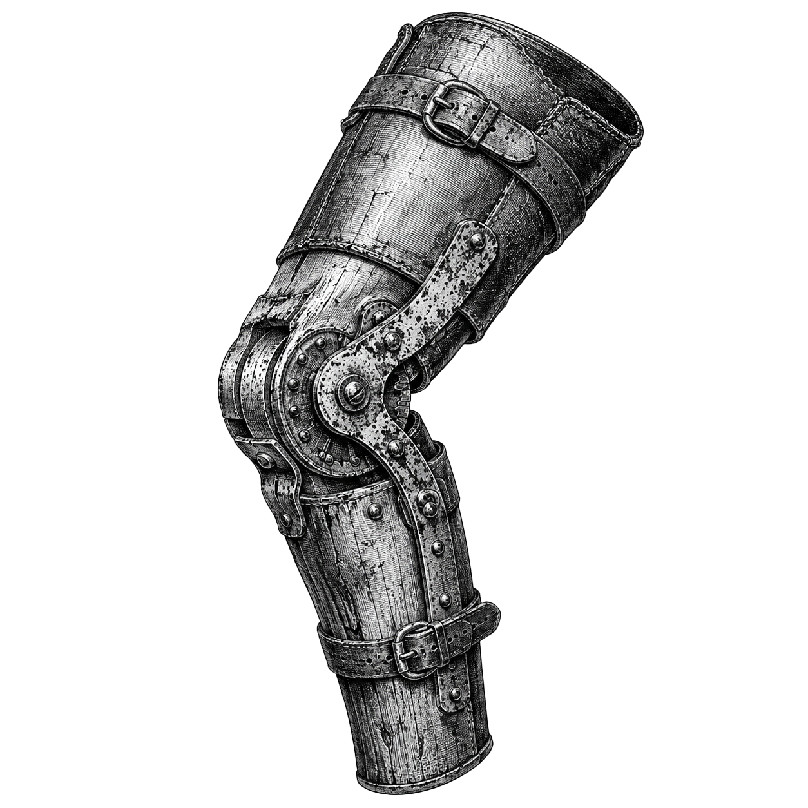

# elbow-helper

[🇫🇷](LISEZ-MOI.md)&nbsp;&nbsp;|&nbsp;&nbsp;[🇬🇧](README.md)

**Noise-robust knee and elbow detection: it reports a knee with uncertainty; it abstains outright otherwise.**



An algorithm can answer the question "where might a knee or an elbow be?" and it will always return something, even on a straight line or on pure noise. `elbow-helper` wraps a from-scratch knee locator in a conservative decision procedure that answers a harder question instead:

> Is any candidate knee strong, unique, persistent, reproducible, and unlikely under a no-knee model? If not, say so.

The design priority is to minimise false-positive knees, even at the cost of more abstentions.

## Why it exists

A knee, on a curve of diminishing returns, marks the point past which extra input buys little extra output: more clusters in k-means, more iterations in an optimiser, more budget on a marketing channel. Existing knee-detection heuristics are excellent at proposing where that point sits, but they carry no notion of confidence. A single point estimate on a noisy curve is easy to over-trust in practice. This package turns that point estimate into a decision backed by evidence. It refuses to answer when the evidence is weak.

## Dependencies

The core depends on `numpy` and [`os-helper`](https://github.com/warith-harchaoui/os-helper) only. The knee-locating algorithm is implemented from scratch, in NumPy only, so there is no `scipy`, `scikit-learn`, `statsmodels`, or `joblib` runtime dependency. Plotting is an optional extra (`matplotlib`, loaded lazily, only when you call it). See Acknowledgements below for the implementation this algorithm follows.

## Install

```bash
pip install -e .            # core: numpy + os-helper
pip install -e ".[plot]"    # + matplotlib for the diagnostic figure
pip install -e ".[dev]"     # + pytest
```

## Quickstart

```python
import numpy as np
from elbow_helper import robust_knee, RobustKneeConfig

x = np.linspace(0, 1, 80)
y = np.where(x <= 0.3, 3*x, 0.9 + 0.2*(x - 0.3))
y = y / y.max() + np.random.default_rng(0).normal(0, 0.02, x.size)

result = robust_knee(x, y, config=RobustKneeConfig(random_seed=0))

if result.is_clear:
    print(result.knee_x, result.ci90, result.detection_rate, result.null_p_value)
else:
    print("no clear knee:", result.reason)
```

`curve` and `direction` are optional: left unset, both are inferred from the data (see below) and can still be passed explicitly, e.g. `robust_knee(x, y, curve="concave", direction="increasing", ...)`. `y` is optional too: call `robust_knee(y)` alone and `x` is taken to be the implicit `0, 1, ..., n-1`.

For the classic k-means or scree "elbow" (convex, decreasing):

```python
from elbow_helper import robust_elbow
result = robust_elbow(k_values, inertia)   # curve/direction fixed to convex/decreasing
```

## Automatic shape and direction

Leaving `curve` or `direction` unset infers them from the cleaned, normalised data. `direction` comes from the sign of the trend between `x` and `y`. `curve` comes from whether the (lightly smoothed) curve lies above or below the straight chord connecting its first and last point: above is concave, below is convex, the mathematical definition, holding for both increasing and decreasing curves. This covers all four concave/convex × increasing/decreasing combinations without asking the caller to name the shape up front. Passing `curve` or `direction` explicitly always overrides the inferred value.

## The contract: a tagged union

`robust_knee` always returns one of two types, both subclasses of `KneeResult` and distinguished by `.is_clear`:

- `ClearKnee`: `knee_x`, `knee_x_norm`, `knee_index`, `ci90` (a 90% bootstrap interval, in data units), `detection_rate`, `smoothing_window`, `sensitivity`, `prominence`, `slope_contrast`, `bic_improvement`, `null_p_value`, and the full `diagnostics`.
- `NoClearKnee`: a machine-readable `reason` code plus `diagnostics`.

You are forced to handle abstention explicitly: there is no silent fallback to a guess.

## How it decides: the pipeline

1. **Preprocess.** Clean, sort, deduplicate, and robustly normalise the data to the unit square, then screen its global shape with a Spearman correlation (a rank-based measure of how monotonic the curve is) and a magnitude-weighted monotonicity check.
2. **Scale-space search.** Run the from-scratch locator across a grid of Gaussian smoothing windows and sensitivities; collect every candidate it proposes.
3. **Basic filters.** Reject boundary knees, weak prominence, and a low prominence-to-noise ratio.
4. **Persistence clustering.** Keep only knees that recur at a stable location across consecutive smoothing scales and most sensitivities. Abstain if two knees look equally plausible (`MULTIPLE_PLAUSIBLE_KNEES`).
5. **Model confirmation.** Require a robust slope change, via a Theil-Sen estimator (a regression method that stays accurate even with outliers), plus a continuous broken-line fit that beats a single straight line on blocked cross-validation and on the BIC (Bayesian Information Criterion, a score that rewards fit while penalising extra parameters).
6. **Bootstrap.** Re-run the whole search on an IID residual bootstrap (independent, identically distributed resampling of the leftover noise). The knee must be redetected at least 90% of the time, with a tight, unimodal interval.
7. **No-knee null test.** Run a Monte Carlo test against a straight-line null model that carries the accepted model's noise scale. The observed knee must be significant at p ≤ 0.01.

Only a candidate that clears every gate becomes a `ClearKnee`.

## Abstention reason codes

`INSUFFICIENT_DATA`, `INVALID_INPUT`, `ZERO_RANGE`, `INCOMPATIBLE_GLOBAL_SHAPE`,
`NO_KNEE_CANDIDATES`, `ALL_CANDIDATES_WEAK`, `NO_PERSISTENT_CLUSTER`,
`MULTIPLE_PLAUSIBLE_KNEES`, `BOUNDARY_KNEE`, `WEAK_SLOPE_CHANGE`,
`SEGMENTED_MODEL_NOT_BETTER`, `BOOTSTRAP_UNSTABLE`, `BOOTSTRAP_MULTIMODAL`,
`NULL_NOT_REJECTED`, `INTERNAL_NUMERICAL_FAILURE`.

## Configuration

Every threshold lives in `RobustKneeConfig`, a frozen dataclass; call `config.with_(...)` to change one. All positional thresholds are expressed in normalised x-range units. The shipped defaults suit a first practical prototype: modest replicate counts, so a run finishes in seconds.

```python
RobustKneeConfig(bootstrap_replicates=100, null_replicates=200)
# validation-grade:
config.with_(bootstrap_replicates=500, null_replicates=1000)
```

A note on these thresholds: they are calibrated, conservative defaults, not universal constants. `cluster_tolerance` and `max_neighbor_shift` sit slightly above the reference plan's 0.05 to absorb the locator's one- or two-sample discretisation jitter at modest sample sizes (n of about 60 to 100). Recalibrate them against your own curve and noise family if needed.

## Diagnostics

```python
from elbow_helper.plotting import plot_diagnostics
plot_diagnostics(x, y, curve="concave", direction="increasing", out="diag.png")
```

Four panels: the curve with the located knee and its interval, the candidate knees across the scale-space, the difference curve used to locate them, and the bootstrap distribution. The point estimate is never shown without its uncertainty.

## Limitations

- The current smoother assumes a regular or near-regular spacing in `x`.
- Auto-detected `curve` and `direction` need a curve with a real, unambiguous trend; on data too weak or noisy to classify confidently, the pipeline abstains with `INCOMPATIBLE_GLOBAL_SHAPE` rather than guessing, the same gate that already screens explicit `curve`/`direction` arguments.
- Detection is discretised to sample locations. On modest `n`, the located knee can sit within a few samples of the truth (median error at or below about 5% of the x-range, on the supported synthetic family).
- The straight-line null and the IID residual bootstrap suit roughly homoscedastic (constant-variance), uncorrelated noise. Wild or moving-block bootstrap variants are future work.
- No finite-data method is infallible. The targets above hold for the documented simulation family, not for every possible curve.

## Standalone locator

The from-scratch locator is usable on its own:

```python
from elbow_helper import KneeLocator
kl = KneeLocator(x, y, S=1.0, curve="concave", direction="increasing", online=True)
kl.knee, kl.all_knees
```

## Mathematics

`MATH-en.md` ([🇫🇷 MATH-fr.md](MATH-fr.md)) derives every formula this package runs, from the single-knee pipeline's normalisation, Spearman screen, Kneedle difference curve, persistence clustering, Theil-Sen slope, BIC, blocked cross-validation, bootstrap and null test, through to the multi-knee research behind `robust_knees` (see also `research/multiknee/RESULTS.md`). Written intuition-first, with a worked example before every formula, for readers from the end of high school through a Ph.D. in applied mathematics. Citations are in `references.bib`, including a few pointers into my own [Favourite AI books](https://deraison.ai/ai-books) where a technique used here deserves a book-length treatment. Compiled copies: `MATH-en.pdf`, `MATH-fr.pdf`.

## Landscape

[🗺️ Landscape](LANDSCAPE.md) ([🇫🇷 PAYSAGE.md](PAYSAGE.md)): how `elbow-helper` compares to `kneed`, `ruptures`, `kneebow`, Yellowbrick's `KElbowVisualizer`, R's `segmented` package, manual eyeballing and asking an LLM, rated on 11 criteria and positioned on a PCA map.

## Acknowledgements

The from-scratch Kneedle implementation in `elbow_helper/kneedle.py` follows the algorithm described by Satopää, Albrecht, Irwin and Raghavan (ICDCSW 2011). Its traversal logic, orientation table and sensitivity threshold closely follow the implementation choices of [`kneed`](https://github.com/arvkevi/kneed) by Kevin Arvai, released under the BSD-3-Clause license:

> Copyright (c) 2017, Kevin Arvai
> All rights reserved.
>
> Redistribution and use in source and binary forms, with or without modification, are permitted provided that the following conditions are met: (1) redistributions of source code must retain the above copyright notice, this list of conditions and the following disclaimer; (2) redistributions in binary form must reproduce the above copyright notice, this list of conditions and the following disclaimer in the documentation and/or other materials provided with the distribution.

`elbow-helper` has no runtime dependency on `kneed`: the algorithm is reimplemented in NumPy only, with the scipy calls replaced as documented in `kneedle.py`.

## License

BSD-3-Clause.
